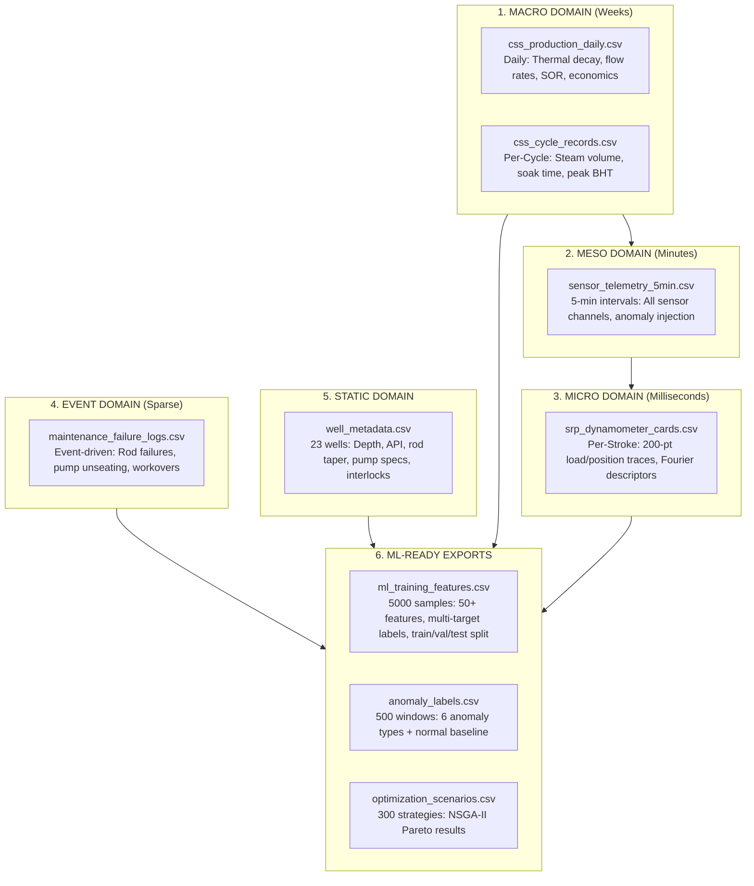

# Baghewala Digital Twin — Production Dataset Catalog

> **PS-26120 · Oil India Limited · SIH 2026**
> Complete physics-grounded synthetic dataset suite for the Well-to-Surface Digital Twin

---

## Dataset Overview

| # | Dataset | Domain | Records | Size | Schema |
|---|---|---|---|---|---|
| 1 | [`css_production_daily.csv`](file:///D:/Tel%20Pragati/dataset/css_production_daily.csv) | **Macro** — Daily Production | ~1,125 rows | 397 KB | 29 columns |
| 2 | [`sensor_telemetry_5min.csv`](file:///D:/Tel%20Pragati/dataset/sensor_telemetry_5min.csv) | **Meso** — 5-min Streaming | ~25,920 rows | 7.5 MB | 22 columns |
| 3 | [`srp_dynamometer_cards.csv`](file:///D:/Tel%20Pragati/dataset/srp_dynamometer_cards.csv) | **Micro** — Dyno Cards | 2,000 cards | 6.9 MB | 25 columns + 200-pt traces |
| 4 | [`css_cycle_records.csv`](file:///D:/Tel%20Pragati/dataset/css_cycle_records.csv) | **Episodic** — CSS Cycles | 15 cycles | 4.8 KB | 27 columns |
| 5 | [`maintenance_failure_logs.csv`](file:///D:/Tel%20Pragati/dataset/maintenance_failure_logs.csv) | **Event** — Failures & Maintenance | 150 events | 30 KB | 20 columns |
| 6 | [`well_metadata.csv`](file:///D:/Tel%20Pragati/dataset/well_metadata.csv) | **Static** — Well Master Data | 23 wells | 6.6 KB | 30 columns |
| 7 | [`ml_training_features.csv`](file:///D:/Tel%20Pragati/dataset/ml_training_features.csv) | **Feature Store** — ML Training | 5,000 samples | 4.6 MB | 58 columns |
| 8 | [`anomaly_labels.csv`](file:///D:/Tel%20Pragati/dataset/anomaly_labels.csv) | **Anomaly** — Sensor Health | 500 windows | 86 KB | 12 columns |
| 9 | [`optimization_scenarios.csv`](file:///D:/Tel%20Pragati/dataset/optimization_scenarios.csv) | **Optimization** — NSGA-II Results | 300 strategies | 84 KB | 21 columns |

**Total: 9 datasets · ~20 MB · ~35,000+ records**

---

## Temporal Multi-Scale Architecture



---

## Dataset Details

### 1. CSS Production Daily (`css_production_daily.csv`)

> **Domain:** Macro — daily granularity across full CSS cycles

**Coverage:** 5 wells (BGW-04, BGW-05, BGW-08, BGW-11, BGW-15) × 3 CSS cycles each = 15 cycles

**Physics Models Applied:**
- `T(t) = T_amb + (T_peak − T_amb) · exp(−t/τ)` — Boberg-Lantz thermal decay
- `μ(T) = μ_ref · exp[B · (1/T_K − 1/T_ref_K)]` — Andrade-Arrhenius viscosity
- `FMI = MPRL / Submerged_Weight` — Rod floating margin

**Key Columns:** `well_id`, `cycle_id`, `cycle_day`, `phase`, `surface_temp_c`, `bottomhole_temp_c_estimated`, `viscosity_cp`, `oil_rate_bopd`, `water_cut_pct`, `sor_instantaneous`, `sor_cumulative`, `fmi`, `rod_floating_risk_pct`, `operating_state`, `net_value_inr_day`

**Operating States:** Normal → High_Viscous_Drag → Rod_Floating_Warning → Rod_Floating_Critical → CSS_Cutoff_Triggered

---

### 2. Sensor Telemetry 5-min (`sensor_telemetry_5min.csv`)

> **Domain:** Meso — high-resolution streaming telemetry

**Coverage:** 2 wells (BGW-08, BGW-11) × 1 full CSS cycle (~45 days) at 5-min intervals

**Anomaly Injection:**
- 1.5% sensor dropout (`quality_flag = missing`)
- 0.5% sensor stuck-at (`quality_flag = out_of_range`)
- 1.0% bias drift (hidden — tests anomaly detection)

**Key Columns:** `temp_1_c`, `temp_2_c`, `pressure_in_psi`, `pressure_out_psi`, `flow_rate_bopd`, `motor_current_a`, `rod_load_peak_lb`, `rod_load_min_lb`, `vibration_mm_s`

---

### 3. SRP Dynamometer Cards (`srp_dynamometer_cards.csv`)

> **Domain:** Micro — per-stroke pump diagnostics

**Coverage:** 2,000 cards with 200-point position/load traces

**Class Distribution (balanced for training, ≥15% each):**

| Class | Count | % | Card Shape |
|---|---|---|---|
| Normal | ~700 | 35% | Smooth parallelogram |
| Rod_Floating | ~500 | 25% | Downstroke compression collapse |
| Fluid_Pound | ~300 | 15% | Horizontal shelf on downstroke |
| Gas_Interference | ~260 | 13% | Rounded S-shaped transitions |
| Traveling_Valve_Leak | ~240 | 12% | Upstroke load bleed-off |

**Includes:** 8 Fourier harmonic descriptors per card for lightweight classifier features

---

### 4. CSS Cycle Records (`css_cycle_records.csv`)

> **Domain:** Episodic — cycle-level configuration & performance

**Coverage:** 5 wells × 3 cycles = 15 records

**Key Columns:** `inject_duration_days`, `soak_duration_days`, `steam_volume_m3`, `steam_quality_pct`, `peak_bht_c`, `thermal_tau_days`, `cycle_sor`, `cutoff_reason`, `cycle_net_value_inr`

---

### 5. Maintenance Failure Logs (`maintenance_failure_logs.csv`)

> **Domain:** Event — sparse discrete failure records (weakly labeled)

**Coverage:** 150 events across 5 wells over 3 years

**Event Distribution:**

| Event Type | Count | Severity |
|---|---|---|
| Rod failure | ~45 | Critical |
| Routine maintenance | ~30 | Info |
| Pump unseating | ~23 | Warning |
| Interlock trip | ~23 | Warning |
| Valve replacement | ~12 | Warning |
| Workover | ~10 | Warning |
| Tubing split | ~5 | Critical |
| Gear failure | ~3 | Critical |

**Includes:** `preceding_fmi`, `preceding_viscosity_cp`, `root_cause`, `mtbf_days` — enabling failure prediction models

---

### 6. Well Metadata (`well_metadata.csv`)

> **Domain:** Static — well configuration & reservoir properties

**Coverage:** All 23 Baghewala wells (BGW-01 through BGW-23)

**Key Properties:** depth (1,050–1,300m), API gravity (14–19°), viscosity at 50°C (10,000–13,000 cP), rod string taper (1"-7/8"-3/4"), pump depth, interlock limits, GPS coordinates

---

### 7. ML Training Features (`ml_training_features.csv`)

> **Domain:** Feature Store — pre-computed, point-in-time correct features with multi-target labels

**Coverage:** 5,000 samples with 70/15/15 train/val/test split (by well AND by time)

**Feature Groups (50+ features):**
- **Thermal:** `bht_estimate_c`, `dBHT_dt_1h`, `viscosity_cp_physics`, `visc_ratio_vs_peak`
- **Mechanical:** `spm`, `motor_current_a`, `spm_x_visc_interaction`
- **Dynamometer:** `pprl_lbs`, `mprl_lbs`, `card_area_in_lbs`, `fmi`, `fourier_h1-h4`
- **Production:** `flow_bopd`, lagged flows (1h/6h/24h), rolling stats
- **CSS Context:** `days_since_injection`, `phase_transition_active`
- **History:** `days_since_last_failure`, `failure_count_trailing_180d`
- **Quality:** `sensor_quality_score`, `cross_sensor_residual`

**Target Labels (multi-task):**
- `target_flow_bopd_1h/6h/24h` — Production Forecaster
- `target_viscosity_residual` — Viscosity Corrector
- `target_card_class` — Dynamometer Classifier
- `target_failure_7d/30d` — Failure Risk Model
- `target_rod_floating_risk` — Rod Floating Composite

---

### 8. Anomaly Labels (`anomaly_labels.csv`)

> **Domain:** Anomaly detection evaluation dataset

**Coverage:** 500 labeled windows (300 anomalies + 200 normal)

**Anomaly Types:** sensor_dropout, sensor_stuck_at, sensor_bias_drift, cross_sensor_mismatch, rate_of_change_violation, physical_impossibility

---

### 9. Optimization Scenarios (`optimization_scenarios.csv`)

> **Domain:** Pre-computed NSGA-II multi-objective optimization results

**Coverage:** 100 scenarios × 3 strategies (A/B/C) = 300 records

**Objectives:** maximize {Production, −SOR, −Energy, −Risk, NetValue(₹/day)}

---

## Metadata Standards

Every dataset file includes a metadata comment header (lines starting with `#`) containing:

```
# Dataset: [Name]
# Version: 1.3.0
# Generated: [ISO-8601 timestamp]
# Description: [What it contains]
# Schema: WellState Canonical v1.0 ([Domain])
# Physics Models: [Which equations were used]
# Field: Baghewala, Jaisalmer, Rajasthan
# Random Seed: 42
```

> [!IMPORTANT]
> All data is labeled `source=synthetic` and `label_source=ground_truth` (or `weak` for maintenance logs). This is by design — the architecture ensures the **exact same schema and pipeline** accepts OIL's real SCADA data via a simple adapter swap.

---

## Generator Scripts

All scripts are reproducible (seed=42) and located in [`generators/`](file:///D:/Tel%20Pragati/dataset/generators):

| Script | Generates |
|---|---|
| [`generate_css_production.py`](file:///D:/Tel%20Pragati/dataset/generators/generate_css_production.py) | `css_production_daily.csv` |
| [`generate_dynamometer_cards.py`](file:///D:/Tel%20Pragati/dataset/generators/generate_dynamometer_cards.py) | `srp_dynamometer_cards.csv` |
| [`generate_maintenance_logs.py`](file:///D:/Tel%20Pragati/dataset/generators/generate_maintenance_logs.py) | `maintenance_failure_logs.csv` |
| [`generate_well_metadata.py`](file:///D:/Tel%20Pragati/dataset/generators/generate_well_metadata.py) | `well_metadata.csv` |
| [`generate_sensor_telemetry.py`](file:///D:/Tel%20Pragati/dataset/generators/generate_sensor_telemetry.py) | `sensor_telemetry_5min.csv` |
| [`generate_css_cycles.py`](file:///D:/Tel%20Pragati/dataset/generators/generate_css_cycles.py) | `css_cycle_records.csv` |
| [`generate_ml_features_anomalies_optimization.py`](file:///D:/Tel%20Pragati/dataset/generators/generate_ml_features_anomalies_optimization.py) | `ml_training_features.csv`, `anomaly_labels.csv`, `optimization_scenarios.csv` |

To regenerate all datasets:
```powershell
cd "D:\Tel Pragati\dataset\generators"
python generate_well_metadata.py
python generate_css_cycles.py
python generate_css_production.py
python generate_sensor_telemetry.py
python generate_dynamometer_cards.py
python generate_maintenance_logs.py
python generate_ml_features_anomalies_optimization.py
```

---

## How This Maps to Your 5 ML Models

| Model | Training Data | Labels From |
|---|---|---|
| **Production Forecaster** (LightGBM quantile) | `ml_training_features.csv` | `target_flow_bopd_1h/6h/24h` |
| **Viscosity Corrector** (Ridge/GBR) | `ml_training_features.csv` | `target_viscosity_residual` |
| **Dynamometer Classifier** (XGBoost/CNN) | `srp_dynamometer_cards.csv` + `ml_training_features.csv` | `downhole_card_class_true` / `target_card_class` |
| **Failure Risk Model** (XGBoost) | `ml_training_features.csv` + `maintenance_failure_logs.csv` | `target_failure_7d/30d` + `failure_event` (weak) |
| **Anomaly Detector** (Rules + IsoForest) | `sensor_telemetry_5min.csv` + `anomaly_labels.csv` | `is_anomaly` + `anomaly_type` |
