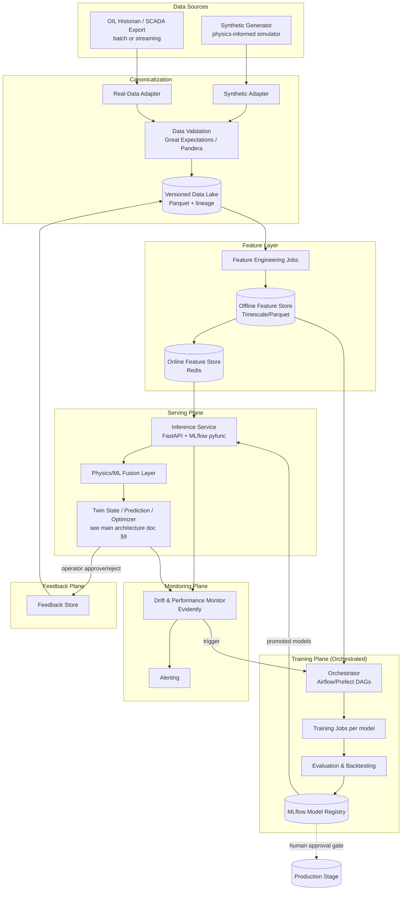
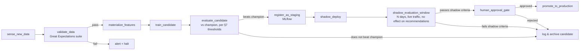
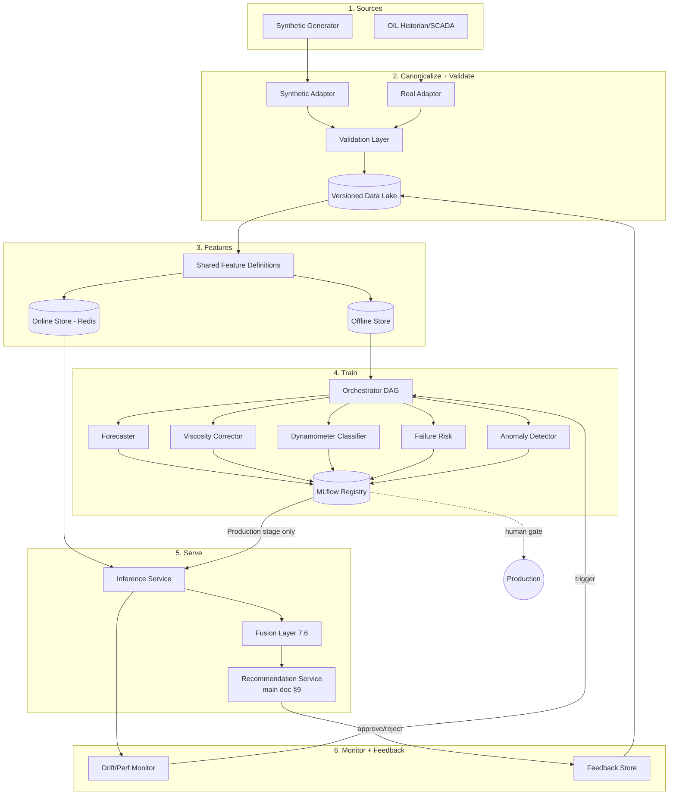

# Baghewala Digital Twin — AI/ML System Architecture (Production Spec)

**Companion document to:** `Baghewala_Digital_Twin_Solution_Architecture.md`, Section 12
**Scope:** This document replaces and deeply expands Section 12 (AI/ML Layer) of the main architecture doc. Everything else in the main doc (frontend, backend services, physics engine, optimizer, control/safety layer, DevOps) is unchanged and this document assumes that context.
**Audience:** Your AI/ML engineers and your coding agent — this is written as a build spec (interfaces, schemas, pipelines, thresholds), not a tutorial. No end-to-end code is included by design; every module below is specified precisely enough that an agent can implement it without guessing the contract.
**Data assumption:** Designed for **two live data sources from day one** — a physics-informed synthetic generator (available now) and OIL's real historian/SCADA export (may arrive later in the project). Nothing here is synthetic-only or real-only; every component has an explicit source-agnostic contract.

---

## Table of Contents

1. Design Philosophy — non-negotiables for this ML system
2. ML System Context Diagram
3. Canonical Data Contract
4. Dual-Path Data Architecture (Synthetic Generator + Real Historian Adapter)
5. Sim-to-Real Transfer & Calibration Strategy
6. Feature Store & Feature Engineering
7. Model Zoo — full specification, model by model
8. Training Pipeline & Orchestration
9. Experiment Tracking & Model Registry
10. Model Serving Architecture
11. CI/CD for ML
12. Deployment Strategy — Shadow, Canary, Champion/Challenger
13. Monitoring & Observability
14. Auto-Retraining Strategy
15. Feedback Loop & Active Learning
16. Explainability & Governance
17. Testing Strategy
18. Infrastructure & Compute
19. Repository Structure
20. Configuration Management
21. Full Assembled Architecture Diagram
22. ML Risk Register
23. Open Items — decisions needed from your team / from OIL
24. Glossary additions

---

## 1. Design Philosophy — non-negotiables

These rules apply to every model, every pipeline, and every dashboard number in this document. Your coding agent should treat them as constraints, not suggestions.

1. **Physics proposes, ML corrects, rules decide.** No ML model in this system is ever the sole author of a control recommendation. Physics (Section 11 of the main doc) produces a first-principles estimate; ML corrects its residual or classifies patterns physics can't express in closed form (card shapes, failure risk); the deterministic Safety/Interlock Engine has final veto power. This is the same separation already established for the Control layer — the ML layer must inherit it, not weaken it.
2. **Every prediction carries a confidence, and confidence is a first-class output, not a nice-to-have.** Confidence Threshold is already one of the 7 hard interlocks in the Control layer (75%) — every model in this document must therefore emit calibrated uncertainty, not just a point estimate.
3. **No model is promoted to production without a human sign-off**, no matter how "automated" the retraining pipeline is. Auto-retraining automates *candidate generation*, never *promotion*. This mirrors the Advisory→Supervised→Automated maturity ladder for control actions — the same ladder applies to model deployment.
4. **Synthetic data is a first-class, versioned, labeled dataset — not a placeholder.** It is generated by a physics-informed simulator so its labels (true downhole state, true fault windows) are known exactly. This is strictly better supervision than most real oilfields ever get, and should be marketed as such, not apologized for.
5. **Real data, when it arrives, is weakly labeled by default.** OIL's historian will give you sensor time series and maybe workover/failure dates — it will *not* give you ground-truth downhole dynamometer cards or ground-truth bottomhole viscosity. Section 5 exists specifically to handle this asymmetry.
6. **Everything is reproducible.** A model artifact must be traceable to: exact training data snapshot hash, exact feature definitions version, exact code commit, exact hyperparameters, exact evaluation report. If you can't answer "what produced this recommendation" six months from now, the system has failed a core requirement, not a nice-to-have.

---

## 2. ML System Context Diagram



**What's new here versus the main doc's Section 12 table:** a full training/serving/monitoring/feedback plane sits *behind* the "ML Inference Service" box from the main architecture diagram. The main doc's `ML Inference Service` = the `INF` node above; everything else here is the machinery that keeps it correct over time.

---

## 3. Canonical Data Contract

Every model in this document is trained and served against **one canonical schema**, regardless of whether the data originated from the synthetic generator or from OIL. This is the single most important design decision in this document — it's what lets you say "the pipeline OIL would plug into already exists and is already tested" on stage.

### 3.1 Canonical entity: `WellState` (one row per well per timestamp)

| Field | Type | Required | Notes |
|---|---|---|---|
| `well_id` | string | yes | matches `well.well_id` in main DB |
| `ts` | timestamp (UTC) | yes | source timestamp, not ingestion time |
| `cycle_id` | string | no | null if outside a tracked CSS cycle |
| `cycle_day` | float | no | days since injection start |
| `phase` | enum{inject,soak,produce,shut_in,unknown} | yes | `unknown` allowed for real data with gaps |
| `surface_temp_c` | float | no | |
| `injection_temp_c` | float | no | |
| `pressure_in_psi` | float | no | |
| `pressure_out_psi` | float | no | |
| `flow_bopd` | float | no | oil rate proxy |
| `tank_level_pct` | float | no | |
| `spm` | float | no | strokes per minute |
| `stroke_len_in` | float | no | |
| `vfd_pct` | float | no | |
| `motor_current_a` | float | no | |
| `rod_load_lb` | array[float] | no | one full-cycle surface load trace, if available |
| `rod_position_in` | array[float] | no | matching position trace |
| `source` | enum{synthetic,rig,scada} | yes | **never omitted** — every downstream consumer keys behavior off this |
| `quality_flag` | enum{ok,missing,out_of_range,quarantined} | yes | per main doc §10.3 |
| `label_source` | enum{ground_truth,weak,none} | yes | see Section 5 — critical for eval segregation |

### 3.2 Canonical labels (separate table, joined by `well_id, ts`)

| Field | Type | Notes |
|---|---|---|
| `bottomhole_temp_c_true` | float, nullable | **only populated for synthetic** (ground truth from simulator) |
| `viscosity_cp_true` | float, nullable | synthetic only |
| `downhole_card_class_true` | enum, nullable | synthetic only, or weak label from workover record for real data |
| `failure_event` | bool, nullable | real data: from maintenance/workover log; synthetic: injected fault flag |
| `failure_type` | enum, nullable | rod_failure / pump_unsetting / other |
| `label_source` | enum{ground_truth,weak,none} | duplicated here for join safety |

> **Rule:** any evaluation report must segment metrics by `label_source`. A model that looks great on `ground_truth` (synthetic) and is untested on `weak` (real) is *not* validated for deployment — this distinction must appear in every model card (Section 16).

---

## 4. Dual-Path Data Architecture

### 4.1 Synthetic Data Generation Engine

This is not a toy data faker — treat it as a proper simulation product with its own versioning, because your training data's credibility depends entirely on it.

**Responsibilities:**
- Simulate `N` wells × `M` CSS cycles × configurable noise seeds, each producing a full canonical `WellState` time series plus ground-truth labels.
- Drive the physics engine (main doc §11) forward in time with a chosen scenario profile, then layer sensor noise, sampling gaps, and **injected faults** on top of the clean physics trajectory.
- Emit output partitioned and versioned so every training run can cite an exact dataset snapshot.

**Scenario config schema** (`configs/data_sources/synthetic.yaml`):
```yaml
generator_version: "1.3.0"
scenarios:
  - name: normal_ops
    css_cycle_days: 45
    inject_days: 5
    soak_days: 2
    peak_bht_c: 140
    thermal_tau_days: 12          # decay time constant, feeds §11.1 of main doc
    spm_profile: constant
    fault_injection: none
  - name: cooling_phase
    inherits: normal_ops
    fault_injection: none
    emphasis_window_days: [20, 30]   # oversample this window in the dataset
  - name: rod_floating
    inherits: normal_ops
    fault_injection:
      type: rod_floating
      onset_day: 28
      severity_ramp: linear
      severity_max: 0.8
  - name: css_cutoff
    inherits: normal_ops
    fault_injection: none
    cutoff_trigger: economic_model    # ties to main doc §13 economic cutoff logic
  - name: energy_min
    inherits: normal_ops
    spm_profile: reduced
    fault_injection: none
noise_model:
  sensor_gaussian_pct: 2.0
  dropout_prob_per_reading: 0.01
  stuck_at_prob_per_run: 0.02
  bias_drift_prob_per_run: 0.03
replicas_per_scenario: 200          # Monte Carlo seeds
output:
  format: parquet
  partition_by: [scenario, well_id, cycle_id]
  path: s3://btwin-datasets/synthetic/{generator_version}/
```

**Fault injection taxonomy** (the label vocabulary every classifier/detector in Section 7 is trained against):

| Fault type | Mechanism simulated | Ground-truth signal injected |
|---|---|---|
| `rod_floating` | Viscous drag exceeds buoyant weight margin on downstroke | Compression window in synthetic card, `downhole_card_class_true = rod_floating` |
| `fluid_pound` | Incomplete pump fillage | Card foreshortening on upstroke |
| `gas_interference` | Compressible fluid entering barrel | Rounded card corners |
| `traveling_valve_leak` | Load bleed-off pattern | Sloped card base |
| `sensor_dropout` | Missing readings for a window | `quality_flag = missing` |
| `sensor_stuck_at` | Frozen value | `quality_flag = out_of_range` after rate-of-change check |
| `sensor_bias_drift` | Slow linear offset | Used to test drift *detection*, not just anomaly detection |
| `leak_proxy` | Unexpected pressure/flow mismatch | Feeds anomaly detector negative-class diversity |

**Generation algorithm (spec, not code):**
1. For each `(scenario, well_id, seed)` triple: instantiate physics engine with scenario's thermal/mechanical parameters.
2. Integrate forward at a fixed timestep (default 5 min) for the full cycle duration, producing the *clean* trajectory and the *true* labels (`bottomhole_temp_c_true`, `viscosity_cp_true`, `downhole_card_class_true`).
3. Derive the *surface-observable* trace from the clean trajectory using the forward form of the Gibbs wave equation (main doc §11.4) — i.e., simulate what a surface load cell *would* see given the true downhole state.
4. Apply the noise model (Gaussian sensor noise, dropout, stuck-at, bias drift) to the surface-observable trace only — never corrupt the ground-truth labels.
5. If `fault_injection` is set, perturb the physics/mechanics state at `onset_day` per the fault's mechanism (see taxonomy table) before step 3, so the fault is causally consistent, not just a label slapped on clean data.
6. Write canonical `WellState` rows (`source=synthetic`, `label_source=ground_truth`) + label rows to the partitioned output path.
7. Register the run in the **Dataset Registry** (Section 4.3) with: generator version, config hash, row count, class balance per fault type, and a data-quality summary report.

**Class balance requirement:** enforce a minimum 15% representation of each fault type in the *training* split (oversample via `emphasis_window_days` and dedicated fault scenarios) — real oilfield faults are rare, but a classifier trained on <1% positive rate will not learn a usable decision boundary. This is a deliberate, documented departure from "real" class frequency, corrected for at evaluation time via stratified test sets (Section 7.x per-model split strategy).

### 4.2 Real Data Adapter (OIL historian / SCADA)

Because you don't yet know OIL's exact export format, build this as a **configurable mapping layer**, not hard-coded parsing.

**Expected source shapes to support (design for all three, implement the one that arrives first):**
- Batch file export (CSV/Excel) from a historian (e.g., OSIsoft PI, Wonderware) — one file per well per period.
- OPC-UA or Modbus tag stream via a gateway OIL operates — near-real-time.
- A flat relational dump (SQL export) of production/CSS/SRP/failure tables matching the categories already listed in the PS ("production history, CSS cycle records, steam injection parameters, VFD/SRP data, rod-failure/pump-unsetting history...").

**Field-mapping config schema** (`configs/data_sources/oil_historian.yaml`):
```yaml
source_type: csv_batch          # csv_batch | opcua_stream | sql_dump
timezone: Asia/Kolkata
field_map:
  "Well_Name":        well_id
  "TimeStamp":         ts
  "WHT_degC":          surface_temp_c
  "Inj_Temp_degC":     injection_temp_c
  "CasingPressure_psi": pressure_in_psi
  "LinePressure_psi":  pressure_out_psi
  "OilRate_BOPD":      flow_bopd
  "SPM":               spm
  "StrokeLength_in":   stroke_len_in
  "VFD_Pct":           vfd_pct
  "MotorCurrent_A":    motor_current_a
unit_conversions:
  # explicit, never implicit — a silently-wrong unit is worse than a missing field
  pressure_in_psi: {from: kg_cm2, factor: 14.223}
missing_field_policy: quarantine   # quarantine | impute_null | reject_row
```

**Adapter responsibilities:**
1. Parse source format per `source_type`.
2. Apply `field_map` and `unit_conversions` to produce canonical `WellState` rows.
3. Set `source=scada`, `label_source=weak` or `none` (real data essentially never has ground-truth downhole state — see Section 5).
4. Route through the **same** validation layer as synthetic data (Section 4.4) before touching the data lake — no special-casing real data as "trusted by default."
5. For any field OIL provides that isn't in the canonical schema yet (e.g., a dynamometer card export, if they have one): land it as-is in a `raw_extra` JSONB sidecar column, so nothing is silently dropped while the canonical schema catches up.

**Weak-label extraction from maintenance/workover logs:** if OIL provides failure/workover records (date, well, failure type — explicitly listed as available data in the PS), map them into the `failure_event`/`failure_type` label fields with `label_source=weak`. This becomes your **only real-world ground truth** for the failure-risk model and for calibrating the dynamometer classifier — treat it as precious and low-volume, not as a full training set.

### 4.3 Dataset Registry & Versioning

- Every materialized dataset (synthetic run or real-data ingestion batch) gets a `dataset_id`, a content hash of the underlying files, the generator/adapter version that produced it, and a pointer to the exact config used.
- Recommended tool: **DVC** (Data Version Control) or **lakeFS** over the Parquet data lake, either is fine — pick one and be consistent. Store the registry metadata in Postgres (a `dataset_version` table) so it's queryable alongside the rest of the app's relational data.
- Every trained model (Section 9) references the exact `dataset_id`(s) used for train/val/test — this is what makes "what produced this recommendation" answerable months later (Design Philosophy #6).

### 4.4 Data Validation Layer

Applied identically to synthetic and real data, immediately after the adapter and before the data lake:

| Check category | Tool | Example rule |
|---|---|---|
| Schema conformance | Pandera | `flow_bopd >= 0`, `spm` between 0–15, timestamp monotonic per well |
| Range/physical plausibility | Great Expectations | `surface_temp_c` between ambient and steam max (~320 °C) |
| Cross-field consistency | Great Expectations | `pressure_out_psi <= pressure_in_psi` (barring known exceptions) |
| Missingness | Great Expectations | fail the batch if >30% of a critical field is null in a window |
| Referential integrity | Pandera/custom | `well_id` exists in `well` table, `cycle_id` (if set) exists in `css_cycle` |

Any row failing a *hard* rule is tagged `quarantined` and excluded from training by default (but retained in the lake for audit — never deleted). Any batch failing an *aggregate* rule (e.g., >30% missing) blocks the whole ingestion run and pages the on-call data engineer rather than silently degrading the dataset.

---

## 5. Sim-to-Real Transfer & Calibration Strategy

This is the single hardest and most important ML problem in the whole project, and it's worth being explicit about it in front of judges: **you can train rich supervised models on synthetic data because you control the ground truth; you cannot fully validate them on real data because OIL's historian will not hand you a verified downhole dynamometer card.** Pretending otherwise is the fastest way to lose credibility with an OIL-affiliated judge. Handle it like this:

1. **Train on synthetic, ground-truth-labeled data.** This is where the dynamometer classifier and the viscosity residual corrector get their primary supervision.
2. **Calibrate, don't retrain, on real weak labels as they arrive.** When OIL's workover/failure log gives you e.g. 12 confirmed rod-failure events, don't try to retrain a deep model on 12 examples — instead:
   - Use them to **calibrate decision thresholds** (e.g., isotonic regression or Platt scaling on the failure-risk model's output probability) so that the *rank-ordering* learned on synthetic data produces *well-calibrated* probabilities on real wells.
   - Use them as a **holdout sanity check**: did the model's predicted risk actually spike before each confirmed failure? Report this as a small, honest case-study table, not a formal test-set metric (n is too small for that).
3. **Feature-distribution alignment check** at every real-data ingestion: compare the marginal distribution of each real-data feature against the distribution the model was trained on (via Evidently's data-drift report, Section 13.1). If a real well's operating envelope falls substantially outside the synthetic training distribution (e.g., much higher measured motor current than any synthetic scenario covered), **flag it explicitly on the dashboard** ("model operating outside training envelope for this well") rather than silently extrapolating.
4. **Never let the model silently claim ground-truth-level confidence on real data.** The `label_source` field (Section 3) must propagate all the way to the UI: the `/diagnostics` page's classifier confidence should visually distinguish "validated against synthetic ground truth" from "calibrated against limited real weak labels" — this is a genuine trust-building differentiator, not just caution for its own sake.
5. **As real data accumulates, shift the training mix.** Track the real:synthetic ratio in each training run's dataset manifest; the roadmap goal is to *increase* real data's share over time, with synthetic staying in the mix indefinitely for rare-fault coverage (real data will likely never contain enough actual rod failures to train a rare-event classifier alone).

---

## 6. Feature Store & Feature Engineering

### 6.1 Feature groups

| Group | Examples | Update cadence | Store |
|---|---|---|---|
| `thermal` | surface_temp, bht_estimate, dT/dt (5/30/60-min rolling), cycle_day | streaming | online + offline |
| `mechanical` | spm, stroke_len, vfd_pct, motor_current, rolling std of current | streaming | online + offline |
| `dynamometer` | card-derived: peak load, min load, card area, slope segments, compression-window duration | per pump cycle (~seconds) | offline (batch-derived), online cache of latest |
| `production` | flow_bopd, lagged flow (1h/6h/24h), rolling mean/std | streaming | online + offline |
| `css_context` | cycle_day, phase, days_since_injection_start, cumulative_steam_volume, prior_cycle_peak_bht | per cycle event | offline |
| `history` | days_since_last_failure, failure_count_trailing_180d, well_age_days | daily batch | offline |
| `quality` | sensor_quality_flag, missingness_rate_1h, cross_sensor_residual | streaming | online |

### 6.2 Feature definition catalog (representative entries)

| Feature name | Definition | Window | Leakage guard |
|---|---|---|---|
| `dBHT_dt_1h` | slope of physics-estimated bottomhole temp over last 1h | 1h trailing | uses only physics estimate available *as of* prediction time |
| `visc_ratio_vs_peak` | current estimated viscosity / peak viscosity this cycle | cycle-to-date | peak computed causally (running max up to `ts`, never full-cycle max) |
| `rod_drag_trend_pct_per_day` | % change in inferred rod drag over trailing 24h | 24h | same causal-max discipline |
| `card_compression_frac` | fraction of downstroke where load < buoyant-weight threshold | per-cycle | derived only from the *current* card, no future cards |
| `spm_x_visc_interaction` | `spm * log(viscosity_cp)` | instantaneous | — |
| `time_since_last_css_event` | hours since last inject/soak/produce transition | instantaneous | — |

### 6.3 Point-in-time correctness (the rule that prevents silent leakage)

Every feature computed for a training row at time `t` must be computable using **only data with timestamp ≤ t** at serving time too. Concretely:
- Rolling statistics use **trailing** windows only, never centered or forward windows.
- Cycle-level aggregates (e.g., "peak BHT this cycle") must be computed as a **running** value up to `t`, and a separate, clearly-named `_final` version (using the whole completed cycle) is only ever used for post-hoc analysis/reporting, never as a training feature.
- The feature engineering job must be implemented once and called identically by both the training pipeline (Section 8) and the online feature computation in the serving path (Section 10) — two separate implementations of "the same" feature is the #1 cause of train/serve skew and must be avoided by construction, not by testing after the fact.

### 6.4 Feature store architecture

- **Offline store:** materialized feature tables in TimescaleDB (or Parquet on the data lake for large backfills), one continuous-aggregate view per feature group, refreshed on ingestion.
- **Online store:** Redis, holding the latest feature vector per `well_id`, updated on each new telemetry sample; this is what the low-latency inference service (Section 10) reads.
- **Feast** (open-source feature store) is the natural upgrade path once you have >~10 wells and multiple teams touching features — it formalizes exactly the offline/online split above with a single feature-definition source of truth. For the current scale, a hand-rolled version of the same pattern (one `feature_definitions/` module generating both the Timescale materialization and the Redis update) is enough; **structure the code so migrating to Feast later is a swap of the storage backend, not a rewrite of feature logic.**

---

## 7. Model Zoo — Full Specification

For each model: objective, labels, features, candidate architectures, uncertainty method, split strategy, promotion thresholds, explainability, interface contract, and known failure modes.

### 7.1 Production Forecaster

**Business question:** what will oil rate be over the next 6–24 hours, and how confident are we?

| Aspect | Spec |
|---|---|
| Label | `flow_bopd` at `t + h` for `h ∈ {1h, 6h, 24h}` (multi-horizon) |
| Features | `production`, `thermal`, `mechanical`, `css_context` groups (Section 6.1) |
| Primary architecture | **LightGBM, quantile objective** (pinball loss) trained separately for p10/p50/p90 — gives a native prediction interval without extra machinery |
| Challenger architecture | **Temporal Fusion Transformer (TFT)** or a simpler seq2seq LSTM with quantile heads, evaluated only once ≥ a few hundred cycle-equivalents of data exist (synthetic replicas count) — do not reach for deep learning before the data volume justifies it |
| Uncertainty | Native quantile outputs (p10/p50/p90); report interval width as the "confidence" surfaced to `/twin` |
| Train/val/test split | **By well AND by time**: hold out entire wells never seen in training (generalization test) *and* hold out the most recent 20% of each remaining well's timeline (temporal test) — report both, they answer different questions |
| Promotion metric | p50 MAE must beat a **naive-persistence baseline** (last observed value) by ≥15%, and p10/p90 empirical coverage must be within [80%, 96%] (target 80% interval) |
| Explainability | SHAP values on the p50 model; surfaced as "top 3 drivers" text on `/twin`'s forecast card |
| Interface contract | `predict(well_id, as_of_ts, horizon) -> {p10, p50, p90, drivers: [...]}` |
| Known failure modes | Degrades sharply during CSS phase transitions (inject→soak, soak→produce) where dynamics are discontinuous — **flag `phase_transition_active` feature explicitly** so the model (and its confidence) can react rather than being blindsided |

### 7.2 Viscosity Residual Corrector

**Business question:** how far is the physics model's `μ = f(T)` estimate from the fluid's *actual* behavior, given everything else we can observe?

| Aspect | Spec |
|---|---|
| Label | `viscosity_cp_true − viscosity_cp_physics` (synthetic, ground truth) |
| Features | physics-predicted viscosity, `mechanical` group (motor current & rod drag are viscosity's real-world fingerprints), `thermal` trend features |
| Primary architecture | **Ridge or Gradient-Boosted regression** on the residual — deliberately simple; this model's entire job is to be a small, explainable correction, not a replacement for the physics curve |
| Uncertainty | Bootstrap ensemble (10–20 resamples) → residual prediction std as confidence proxy |
| Split strategy | By well and by scenario (ensure `rod_floating`/`cooling_phase` scenarios are represented in both train and test — this is exactly where physics is weakest and correction matters most) |
| Promotion metric | Corrected estimate's MAE vs `viscosity_cp_true` must beat **physics-only** MAE by ≥10%, and must **never** be worse than physics-only on any individual scenario bucket (a net-positive-average model that quietly makes `rod_floating` scenarios worse is not acceptable — check per-scenario, not just aggregate) |
| Explainability | Coefficients (Ridge) or SHAP (GBR) — this model should be simple enough to *show the equation* on `/physics`, matching the "explainable core" principle |
| Interface contract | `correct(physics_estimate, features) -> {corrected_estimate, correction_confidence}` |
| Known failure modes | Only ever validated on synthetic ground truth (Section 5) — real-data performance is **calibration-checked, not benchmarked**, until real viscosity measurements (lab PVT data, if OIL provides any) exist |

### 7.3 Dynamometer Condition Classifier

**Business question:** given a reconstructed downhole card, is this well operating normally, or showing rod floating / fluid pound / gas interference / traveling-valve leak?

| Aspect | Spec |
|---|---|
| Label | `downhole_card_class_true` (synthetic ground truth) or weak label from workover record (real data, coarse: "failure occurred" not "which class") |
| Features | `dynamometer` group — card-derived scalar features (peak/min load, area, slope segments, compression fraction) **plus** the raw curve itself as a secondary input |
| Primary architecture | **Gradient-boosted classifier (XGBoost/LightGBM) on card-derived scalar features** — fast, explainable, good baseline |
| Challenger architecture | **1D-CNN over the resampled (load, position) curve** (resample every card to a fixed 200-point sequence) — worth the added complexity once class labels are plentiful (synthetic gives you this immediately); compare against the scalar-feature GBM honestly, don't assume the CNN wins |
| Uncertainty | Softmax probabilities, **temperature-scaled** (Platt-style calibration) against a held-out synthetic set, then **recalibrated again** against any real weak labels per Section 5 |
| Split strategy | Stratified by class (enforce the ≥15% minority-class floor from Section 4.1) and by well |
| Promotion metric | Macro-F1 ≥ 0.85 on synthetic ground-truth test set; for the `rod_floating` class specifically, recall ≥ 0.90 (missing a real rod-floating event is much costlier than a false alarm — bias the operating threshold accordingly, don't just optimize F1) |
| Explainability | SHAP on the scalar-feature model; for the CNN challenger, class-activation-style highlighting of which part of the card drove the classification (e.g., Grad-CAM equivalent for 1D signals) — shown directly on the `/diagnostics` card overlay |
| Interface contract | `classify(card_trace) -> {class, probabilities: {...}, confidence}` |
| Known failure modes | Real-world cards will have noise/sampling characteristics the synthetic generator may not perfectly replicate — this is exactly why Section 5's distribution-alignment check exists; treat any large drift-report flag on `dynamometer` features as a signal to review the noise model, not just the classifier |

### 7.4 Failure-Risk Model (Rod / Pump)

**Business question:** what is the probability of a rod or pump failure in the next `N` days for this well?

| Aspect | Spec |
|---|---|
| Label | `failure_event` within horizon `N ∈ {7, 30}` days (synthetic: injected fault ground truth; real: weak label from workover log) |
| Features | `mechanical`, `dynamometer`, `history` groups; classifier output from 7.3 as an input feature (stacked model) |
| Primary architecture | **XGBoost with a survival-style label** (time-to-event) if failure timestamps are available, else standard binary classification per horizon |
| Uncertainty | Predicted probability + **calibration curve check** (this model's calibration matters more than its discrimination — a well-calibrated 30% is more useful to an operator than a sharp but overconfident 90%) |
| Split strategy | By well; **time-based** split is essential here too — never let a model see a well's future failure history "before" it in training |
| Promotion metric | AUC ≥ 0.80 on synthetic test set; **Brier score** tracked explicitly (calibration matters as much as ranking here); on real weak labels, report the small-n case-study (Section 5.2) rather than a formal metric |
| Explainability | SHAP force plot per prediction — this is the model most likely to be challenged by an OIL engineer ("why do you think *this* well will fail?"), so per-prediction explanation is not optional |
| Interface contract | `predict_risk(well_id, as_of_ts, horizon_days) -> {probability, calibrated_probability, top_drivers, confidence}` |
| Sub-component: Rod-Floating Risk Index weight calibration | The composite index formula in main doc §11.5 (`w1, w2, w3`) is **fit, not guessed** — run a constrained regression (weights ≥ 0, sum to 1) of the index against labeled `rod_floating` onset events from synthetic data, then sanity-check against any real events. This keeps the index explainable (still a weighted sum an engineer can read) while making the weights evidence-based rather than arbitrary. |

### 7.5 Anomaly / Sensor-Health Detector

**Business question:** is this specific reading trustworthy right now?

| Aspect | Spec |
|---|---|
| Label | None needed for the unsupervised base layer; synthetic injected faults (`sensor_dropout`, `stuck_at`, `bias_drift`) provide evaluation labels |
| Features | `quality` group — cross-sensor residuals, rate-of-change, missingness rate |
| Primary architecture | **Rule-based checks** (hard bounds, rate-of-change limits, cross-sensor consistency — e.g., flow > 0 while pump is off is impossible) run first and cheaply; **Isolation Forest** on the residual feature set catches softer, multivariate anomalies rules miss |
| Uncertainty | Anomaly score (Isolation Forest path length) + explicit rule-trip reason string |
| Split strategy | Evaluate against synthetic fault-injection windows as the labeled test set |
| Promotion metric | Precision ≥ 0.90, Recall ≥ 0.85 against injected-fault windows; false-positive rate on `normal_ops` scenario ≤ 2% (a detector that cries wolf on clean data will get ignored by operators, which is worse than a slightly-missed real fault) |
| Explainability | Rule-trip reason is inherently explainable; Isolation Forest path contributes are reported as "which feature looked most unusual" |
| Interface contract | `check(reading) -> {quality_flag, anomaly_score, reason}` — this is the **first** thing every other model's input passes through; a `quarantined` verdict here should short-circuit downstream inference for that reading, not just get logged |

### 7.6 Physics/ML Fusion & Confidence Estimator

**Business question:** how much should the twin trust the physics estimate vs. the ML estimate for a given quantity right now, and what single "agreement %" and "divergence %" should the `/twin` page show?

| Aspect | Spec |
|---|---|
| Inputs | Physics engine's point estimate, ML model's point estimate (from 7.1/7.2), each model's own confidence |
| Method | **Not a trained model at first** — start with a transparent weighted-average / inverse-variance fusion: `fused = (phys/σ_phys² + ml/σ_ml²) / (1/σ_phys² + 1/σ_ml²)`, `divergence % = |phys − ml| / fused`, `agreement % = 100 − divergence%` (bounded). This is deliberately simple and auditable — it's a trust-display mechanism, not a place to hide complexity. |
| Upgrade path | Once enough paired (physics, ML, ground-truth) triples exist, a small learned fusion weight (logistic regression predicting "which source is closer to truth this time, given context") can replace the fixed inverse-variance rule — but only if it demonstrably beats the simple rule; don't add ML here for its own sake |
| Interface contract | `fuse(physics_estimate, physics_conf, ml_estimate, ml_conf) -> {fused_value, agreement_pct, divergence_pct}` |

---

## 8. Training Pipeline & Orchestration

### 8.1 Orchestrator choice

**Primary recommendation: Apache Airflow** (most widely recognized in industrial/enterprise contexts — a plus when presenting to OIL). **Lightweight alternative: Prefect 2** if your team wants faster local iteration during the hackathon and a smaller ops footprint; the DAG structure below is written to be portable between the two.

### 8.2 DAG structure (one DAG per model family, sharing common tasks)



**Task specs:**
- `sense_new_data`: polls the Dataset Registry (Section 4.3) for new dataset versions since the last successful run; short-circuits (no-op) if nothing new.
- `validate_data`: runs the Great Expectations suite from Section 4.4; failure halts the DAG and pages, never silently proceeds with bad data.
- `materialize_features`: calls the **same** feature engineering module used at serving time (Section 6.3's shared-implementation rule) to build the offline training table.
- `train_candidate`: trains per the model's spec in Section 7, using **Optuna** for hyperparameter search (default: 50 trials, TPE sampler, objective = the model's promotion metric) within the search space defined in that model's config (Section 20).
- `evaluate_candidate`: computes the full metric suite from Section 7 (not just the promotion metric) and writes an evaluation report artifact.
- `register_as_staging`: logs the model to MLflow (Section 9) with full lineage metadata, tagged `stage=Staging`.
- `shadow_deploy` / `shadow_evaluation_window`: see Section 12.
- `human_approval_gate`: **blocking task** — the DAG genuinely pauses (Airflow's `ExternalTaskSensor` on a manual-approval signal, or an equivalent Prefect pattern) until a designated Engineer role approves via the same audit-logged workflow pattern as control-action approval in the main doc (§14.3). This is deliberate symmetry: model promotion and control-action dispatch use the *same* human-accountability pattern.

### 8.3 Scheduling

| DAG | Trigger |
|---|---|
| Data validation | On every new dataset registry entry (event-driven) |
| Full retraining | Weekly (scheduled) **and** event-driven (see Section 14 triggers) |
| Shadow evaluation | Continuous while any model is in `Staging` |
| Drift monitoring | Every 1h on live inference logs |

---

## 9. Experiment Tracking & Model Registry

**Tool: MLflow** (self-hosted; tracking server + artifact store backed by the same object storage as the data lake).

- **Tracking:** every training run logs params, the full metric suite (not just the promotion metric), the exact `dataset_id`(s) used, the code commit hash, and the evaluation report artifact (including per-scenario and per-`label_source` breakdowns per Sections 5 and 7).
- **Registry stages:** `None → Staging → Production → Archived`. A model can only reach `Production` via the human approval gate (Section 8.2); nothing else writes that stage transition.
- **Tagging convention:** every registered model version is tagged with `model_family`, `label_source_validated_on` (`ground_truth` / `weak` / `both`), and `physics_dependency` (which physics-engine version it assumes, since a physics-engine calibration change can silently invalidate a residual-correction model trained against the old curve).
- **Model card auto-generation:** on promotion, auto-generate a Markdown model card (Section 16.2) from the run's logged metadata — don't hand-write these, derive them from what's already tracked so they can't drift out of sync with reality.

---

## 10. Model Serving Architecture

- **Serving pattern:** FastAPI service loading models via `mlflow.pyfunc.load_model()` pointed at the registry's `Production`-stage URI — the same MVP pattern as the rest of the backend (main doc §9), consistent tech choices reduce operational surface area.
- **Latency budget:** target <200ms p95 per inference call (the twin loop runs on a 1–5s tick per main doc §7, so this leaves comfortable headroom); if the CNN challenger (Section 7.3) can't hit this on CPU, keep the GBM as the serving model and run the CNN offline/batch for research comparison only.
- **Online feature retrieval:** reads the latest feature vector from the Redis online store (Section 6.4) — the serving path never recomputes features from raw telemetry inline, it always goes through the shared feature module writing to Redis asynchronously as new telemetry arrives.
- **Fallback behavior (critical):** if the ML Inference Service is unavailable or a specific model's confidence is missing/stale, the Fusion Layer (Section 7.6) falls back to **physics-only** output with `agreement_pct` undefined and a clear "ML unavailable, physics-only estimate" flag surfaced to the UI — the twin must degrade gracefully, never silently freeze or crash the operator-facing dashboard.
- **Scaling path:** if/when this needs to run at real multi-well, multi-tenant scale, migrate the serving layer to **KServe or Seldon Core** on Kubernetes, which give you canary/shadow traffic-splitting as an infrastructure primitive instead of hand-rolled logic — note this as the deliberate next step, don't build it prematurely for a demo-scale deployment.

---

## 11. CI/CD for ML

Separate pipeline from the application CI/CD in the main doc (§17.3), triggered by changes under `ml/`.

```yaml
# .github/workflows/ml-ci.yml (representative)
on:
  pull_request:
    paths: ["ml/**"]
  schedule:
    - cron: "0 3 * * 1"   # weekly retraining trigger

jobs:
  lint-and-unit-test:
    steps:
      - run: ruff check ml/
      - run: pytest ml/tests/unit

  data-contract-test:
    steps:
      - run: pytest ml/tests/data_validation   # runs Great Expectations suites against a fixed sample

  training-smoke-test:
    steps:
      - run: python ml/pipelines/train.py --config smoke_test.yaml --max-rows 1000
        # fast, tiny-data run proving the pipeline executes end-to-end before a real (slow) training job

  full-training-and-eval:
    if: github.event_name == 'schedule' || contains(github.event.pull_request.labels.*.name, 'run-full-training')
    steps:
      - run: python ml/pipelines/train.py --config production.yaml
      - run: python ml/pipelines/evaluate.py --compare-to-champion
      # writes evaluation report as a build artifact; does NOT auto-promote

  register-candidate:
    needs: full-training-and-eval
    steps:
      - run: python ml/pipelines/register.py --stage Staging
      # human approval gate (Section 8.2/12) happens outside CI, in the orchestrator/registry UI
```

**Key discipline:** CI/CD automates everything up to and including registering a `Staging` candidate. It **never** calls the promotion-to-`Production` step — that stays a human action recorded through the same audit path as everything else in this system.

---

## 12. Deployment Strategy — Shadow, Canary, Champion/Challenger

| Stage | What happens | Duration | Exit criteria |
|---|---|---|---|
| **Shadow** | New model runs alongside the current `Production` model on live (or replayed) traffic; its predictions are logged but **never** shown to operators or fed to the optimizer | Minimum 3 full CSS-cycle-equivalents (or 10 days on continuous data) | Logged metrics computed vs. same ground truth/weak labels the champion is judged on |
| **Human approval gate** | Engineer reviews shadow evaluation report (Section 9's auto-generated model card + shadow metrics) | — | Explicit approve/reject, logged |
| **Canary** (once scaled onto Kubernetes serving, Section 10) | New model serves a small % of inference traffic (e.g., 10%), old model serves the rest; both logged | 1–2 weeks | No regression in any Section 7 promotion metric on canary slice |
| **Full promotion** | New model becomes sole `Production` server for that model family | — | — |
| **Rollback** | Immediate revert to previous `Production` version | Triggered by any hard-limit breach traceable to the new model, or by sustained drift alert (Section 13) | One-command revert via MLflow registry stage change — this must be **fast and rehearsed**, not theoretical |

For the hackathon-scale deployment (single serving instance, Section 10's MVP), "canary" collapses to "shadow, then full promote" — that's fine; keep the *concept* and the *audit trail* even when the traffic-splitting infrastructure isn't there yet.

---

## 13. Monitoring & Observability

### 13.1 Data drift detection

**Tool: Evidently AI** (open-source, generates drift reports comparing a reference window to current production data).

| Test | Applied to | Threshold | Action on breach |
|---|---|---|---|
| Population Stability Index (PSI) | Each numeric feature in the online store | PSI > 0.2 = warn, > 0.3 = alert | Flag feature on internal MLOps dashboard; if sustained 24h, trigger retraining candidate (Section 14) |
| Kolmogorov–Smirnov test | Each numeric feature, reference vs. rolling 7-day window | p < 0.01 | Same as above |
| Category frequency shift | `phase`, `source`, `quality_flag` | Chi-squared p < 0.01 | Investigate ingestion pipeline first — categorical drift here often means an upstream adapter bug, not real drift |
| **Physics/ML divergence trend** (Section 7.6 output) | `divergence_pct` over time | Sustained > 15% for > 24h | This is your **own best drift signal** — it means physics and ML are disagreeing more than usual, regardless of which one is "right"; surface directly on `/twin` per main doc §7, and treat as a first-class retraining trigger |

### 13.2 Concept drift / performance monitoring

- Track each model's **rolling evaluation metric** (from Section 7's promotion metric) computed against whatever labels become available with a lag (immediate for synthetic replay, delayed for real weak labels).
- Compare rolling metric against the value recorded at promotion time; a sustained relative degradation >20% over the model's own baseline triggers a retraining candidate.

### 13.3 Prediction & confidence monitoring

- Track the **distribution of emitted confidence scores** per model — a model that suddenly starts emitting uniformly high or uniformly low confidence (even if point predictions look fine) is a calibration red flag, not just a curiosity.
- Track **interlock-relevant near-misses**: how often does a recommendation's confidence sit just above the 75% Control-layer threshold? A cluster of "just barely passing" recommendations is worth a human look even if none individually breached anything.

### 13.4 Alerting matrix

| Signal | Severity | Route |
|---|---|---|
| Data validation hard-rule failure | Critical | Page on-call data engineer, halt ingestion |
| Sustained physics/ML divergence >15%/24h | Warning | MLOps dashboard + Slack/email to AI/ML lead |
| PSI > 0.3 on any feature | Warning | MLOps dashboard |
| Rolling performance degradation >20% | Warning → Critical if sustained 3+ days | Triggers retraining candidate automatically (Section 14) |
| Inference service down / fallback-to-physics engaged | Critical (operational) | Same channel as main doc's application alerting (§17.5) |

### 13.5 Dashboards

- **Operator-facing** (already specified): `/twin`'s agreement/divergence numbers, `/diagnostics`'s classifier confidence — these are the *consumer* view of everything in this section, deliberately simplified.
- **Internal MLOps dashboard** (new, for your AI/ML team, not for judges' main demo unless asked): Grafana panels for PSI/KS trends per feature, rolling metric-vs-baseline per model, shadow evaluation status, retraining pipeline run history. Worth having ready to show if a judge specifically asks "how do you know the model won't silently degrade" — a real dashboard answers that far better than a slide.

---

## 14. Auto-Retraining Strategy

| Trigger type | Condition | What "automatic" means here |
|---|---|---|
| Scheduled | Weekly | Kicks off Section 8's DAG through `evaluate_candidate`; **stops** at the human approval gate |
| Drift-triggered | Sustained PSI/KS breach (13.1) or sustained physics/ML divergence >15%/24h | Kicks off the DAG immediately rather than waiting for the weekly schedule; same stop point |
| Performance-triggered | Rolling metric degradation >20% for 3+ days (13.2) | Same |
| Data-availability-triggered | New labeled failure event ingested (a real workover record lands) | Triggers the **failure-risk model's** DAG specifically — new ground truth, however sparse, is valuable enough to react to immediately |

**What "fully automated" correctly means in this document:** the entire path from trigger → data validation → feature materialization → training → evaluation → shadow deployment → shadow evaluation report is unattended. The **only** manual step is the approval gate before `Production` promotion (Section 8.2) — and that is by design, not a gap to close later. A system that can silently promote a worse or miscalibrated safety-adjacent model into production on its own is not a feature to build toward; it's the specific failure mode this architecture is designed to prevent.

**Rollback plan:** any promoted model can be reverted to the previous `Production` version via a single registry stage change (Section 12); the previous version's artifact is never deleted, only archived, specifically to make this always possible.

---

## 15. Feedback Loop & Active Learning

- Every operator **approve/reject** action on a recommendation (main doc §14.3) is written to a `feedback` table keyed to the exact model version(s) that produced the underlying prediction.
- **Rejections are signal, not noise.** A pattern of rejections for a specific action type or well is a prompt for an Engineer to review — surfaced on the internal MLOps dashboard, not auto-incorporated as a negative label without review (operator rejections can reflect factors the model doesn't see, e.g., an unplanned maintenance window — treat as a lead for investigation, not automatic ground truth).
- **Confirmed outcomes** (e.g., an approved VFD change followed by an observed reduction in rod-floating risk matching the prediction) *can* be folded back into training data with `label_source=weak` once a human has reviewed the causal link — this is the project's active-learning loop, and it should start small and reviewed, not automated from day one.
- **Cold-start handling:** until enough real feedback accumulates, the system runs entirely on synthetic-trained models with the calibration discipline from Section 5 — be upfront about this timeline in any pitch ("today: synthetic-trained + physics-calibrated; month 3 of a pilot: real feedback starts correcting calibration; month 6+: real data begins to dominate the training mix").

---

## 16. Explainability & Governance

### 16.1 Explainability methods by model

| Model | Method | Where it's shown |
|---|---|---|
| Production forecaster | SHAP on p50 model | `/twin` forecast card, "top 3 drivers" |
| Viscosity corrector | Coefficients / SHAP | `/physics`, alongside the equation |
| Dynamometer classifier | SHAP (GBM) / activation highlighting (CNN) | `/diagnostics`, overlaid on the card |
| Failure-risk model | SHAP force plot | `/diagnostics` or `/control`, per-recommendation explanation |
| Anomaly detector | Rule-trip reason + feature contribution | Alert panel |
| Fusion layer | Inherently transparent (weighted formula) | `/twin` agreement/divergence |

### 16.2 Model card schema (auto-generated per Section 9)

```yaml
model_name: dynamometer_condition_classifier
version: "2.1.0"
promoted_at: 2026-09-14T10:03:00Z
approved_by: <engineer user_id>
training_dataset_ids: [ds_synth_v1.3.0_run_0042]
label_source_validated_on: ground_truth   # ground_truth | weak | both
physics_dependency: physics_engine_v0.9.2
metrics:
  macro_f1: 0.88
  rod_floating_recall: 0.93
  per_scenario_breakdown: {...}
known_limitations:
  - "Not yet validated against real dynamometer data; calibrated only against synthetic ground truth."
  - "CNN challenger not yet promoted; scalar-feature GBM is production model."
intended_use: "Advisory classification surfaced on /diagnostics; not authorized for Automated-tier dispatch."
```

### 16.3 Governance / sign-off workflow

Mirrors the main doc's control-action audit trail exactly: every model promotion is an `audit_event` (extend the main doc's `audit_event.event_type` enum with `model_promoted`, `model_rolled_back`) linked to the approving user and the model version — one unified audit story for "what changed and who approved it," whether the change is a control action or a model.

---

## 17. Testing Strategy

| Layer | What's tested | How |
|---|---|---|
| Unit | Feature engineering functions produce correct, leakage-free outputs | `pytest`, fixed synthetic input/output pairs |
| Data contract | Every adapter output conforms to the canonical schema | Pandera schema tests in CI (Section 11) |
| Data validation | Great Expectations suites catch known-bad synthetic fixtures | CI, using deliberately corrupted sample files |
| Model regression | A newly trained candidate never silently regresses on a fixed "golden" evaluation set | Stored golden set per model, checked every training run |
| Backtesting | Production forecaster and failure-risk model evaluated on strictly time-held-out historical windows | Scheduled, reported in the model card |
| Integration | Full pipeline (ingest → feature → predict → fuse → recommend) runs against the replay adapter (main doc §8.3) without errors | CI smoke test, small synthetic scenario |
| Chaos / fault injection | Anomaly detector and Safety/Interlock Engine correctly handle a dropped sensor, a stuck-at-value sensor, and an out-of-envelope reading | Scheduled test using synthetic fault scenarios (Section 4.1's taxonomy) |

---

## 18. Infrastructure & Compute

| Workload | Compute profile | Notes |
|---|---|---|
| Synthetic data generation | CPU, embarrassingly parallel across (scenario, well, seed) | Can run as a batch job on any commodity VM or CI runner |
| Feature materialization | CPU, I/O-bound | TimescaleDB continuous aggregates handle most of this without a separate compute layer |
| Training — GBM models (7.1, 7.2, 7.4) | CPU, single-node, minutes per run | No GPU required |
| Training — CNN challenger (7.3) | CPU is workable for the small 1D-CNN spec'd here; GPU is a nice-to-have, not a requirement | Keep the primary GBM as the production model regardless |
| Serving | CPU, low-latency, single small instance sufficient at demo scale | Co-locate with the backend API host for the hackathon; separate later if load requires |
| Orchestrator (Airflow/Prefect) | Small dedicated VM/container; scheduler + worker | Can share infra with the backend's staging environment for the hackathon |
| MLflow tracking + registry | Small dedicated service + object storage (S3-compatible) | Self-hosted is fine at this scale |
| Monitoring (Evidently reports, Grafana) | Lightweight, can run as scheduled jobs producing static reports if a full always-on dashboard isn't worth the setup time yet | Start with scheduled reports, upgrade to live dashboard only if useful for the demo |

---

## 19. Repository Structure

```
ml/
  configs/
    models/
      production_forecaster.yaml
      viscosity_corrector.yaml
      dynamometer_classifier.yaml
      failure_risk.yaml
      anomaly_detector.yaml
      fusion.yaml
    data_sources/
      synthetic.yaml
      oil_historian.yaml
    pipelines/
      training_pipeline.yaml
      smoke_test.yaml
  data/
    generators/            # synthetic simulation engine (Section 4.1)
    adapters/
      synthetic_adapter/
      oil_historian_adapter/  # Section 4.2
    schemas/                # canonical WellState + label schemas (Section 3), Pandera definitions
    validation/              # Great Expectations suites (Section 4.4)
    registry/                 # dataset versioning client (Section 4.3)
  features/
    definitions/             # one module per feature group (Section 6.1), shared by training + serving
    offline_store/
    online_store/
  models/
    production_forecaster/
    viscosity_corrector/
    dynamometer_classifier/
    failure_risk/
    anomaly_detector/
    fusion/
    common/                  # shared interfaces: predict(), explain(), calibrate()
  pipelines/
    dags/                    # Airflow/Prefect DAG definitions (Section 8)
    tasks/
  serving/
    api/                     # FastAPI inference service (Section 10)
    registry_client/         # MLflow pyfunc loader
  monitoring/
    drift/                   # Evidently report jobs (Section 13.1)
    performance/              # rolling metric tracking (Section 13.2)
    dashboards/
  governance/
    model_cards/              # auto-generated, per Section 16.2
  tests/
    unit/
    data_validation/
    model_regression/
    integration/
    chaos/
```

---

## 20. Configuration Management

- **Per-model YAML configs** (shown throughout Section 7's specs) define feature set references, hyperparameter search space, split strategy, and promotion thresholds — these are the single source of truth the training pipeline reads, not hard-coded values in training scripts.
- **Environment overlays:** `configs/env/{local,staging,production}.yaml` override infra-level settings (registry URI, data lake path, Redis host) without touching model logic configs — standard 12-factor-style separation.
- **Schema-validate every config on load** (Pydantic models mirroring the YAML schemas shown in this document) — a malformed config should fail fast at DAG-start, not three hours into a training run.

---

## 21. Full Assembled Architecture Diagram



---

## 22. ML Risk Register

| Risk | Impact | Mitigation |
|---|---|---|
| Model overconfident on out-of-distribution real wells | Bad recommendation trusted by operator | Distribution-alignment check (Section 5.3), confidence-threshold interlock, explicit "outside training envelope" UI flag |
| Synthetic generator's noise/fault model doesn't match real sensor behavior | Classifier/detector underperforms silently in the field | Sim-to-real calibration (Section 5), honest small-n case studies instead of overclaimed metrics |
| Operator rejection data misused as ground truth | Model learns to avoid *correct but unpopular* recommendations | Human review before folding feedback into training labels (Section 15) |
| Physics-engine recalibration silently invalidates a residual-correction model | Corrector applied against a curve it wasn't trained for | `physics_dependency` version tag on every model (Section 9), CI check that flags mismatched versions |
| Auto-retraining pipeline promotes on a technicality (metric improves narrowly but a specific scenario regresses) | Net-negative deployment for a subset of wells/scenarios | Per-scenario, per-`label_source` breakdown required in every evaluation report (Sections 7 & 9), not just the aggregate promotion metric |
| Rare-event classes (real rod failures) never accumulate enough real data | Failure-risk model stays synthetic-dependent indefinitely | Explicit roadmap acknowledgment (Section 15); don't overclaim real-world validation timeline to OIL |

---

## 23. Open Items — Decisions Needed From Your Team / From OIL

1. **Which real-data export format will OIL actually provide first** (batch CSV historian export vs. a live OPC-UA feed vs. a relational dump)? This determines which branch of Section 4.2's adapter to build first — recommend building the batch CSV path first regardless, since it's the most likely and the least infrastructure-dependent to receive.
2. **Does OIL have any lab-measured PVT (viscosity) data** for Baghewala crude beyond the two published anchor points? This would materially strengthen Section 7.2's real-world calibration story.
3. **Confirm compute budget** for the hackathon/pilot phase — the whole stack above is designed to run comfortably CPU-only on modest cloud instances; flag now if GPU access is actually available, since it would change the CNN challenger (7.3) and TFT challenger (7.1) from "later, if justified" to "worth trying now."
4. **Who holds the Engineer role for the human-approval gate** (Section 8.2, Section 12)? This should be decided before the first shadow-deployment cycle, not improvised at pipeline go-live.

---

## 24. Glossary Additions

| Term | Meaning |
|---|---|
| PSI | Population Stability Index — drift metric comparing two distributions |
| Champion/Challenger | The currently-promoted model ("champion") vs. a candidate being evaluated ("challenger") |
| Shadow deployment | Running a candidate model on live traffic without its output affecting any real decision |
| Point-in-time correctness | Guarantee that a feature's training-time value uses only information available as of that timestamp |
| Weak label | A label inferred indirectly (e.g., from a workover date) rather than directly observed ground truth |
| Model card | Structured document describing a model version's training data, metrics, and limitations |
| Sim-to-real transfer | Adapting a model trained on simulated data to perform reliably on real-world data |

---

*This document should be updated in lockstep with the main architecture doc's Section 4 (field facts) and Section 11 (physics engine) — any physics recalibration should immediately prompt a check of every model's `physics_dependency` tag per Section 9.*
