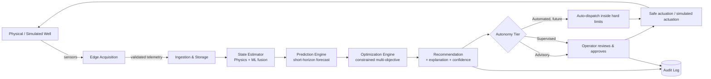
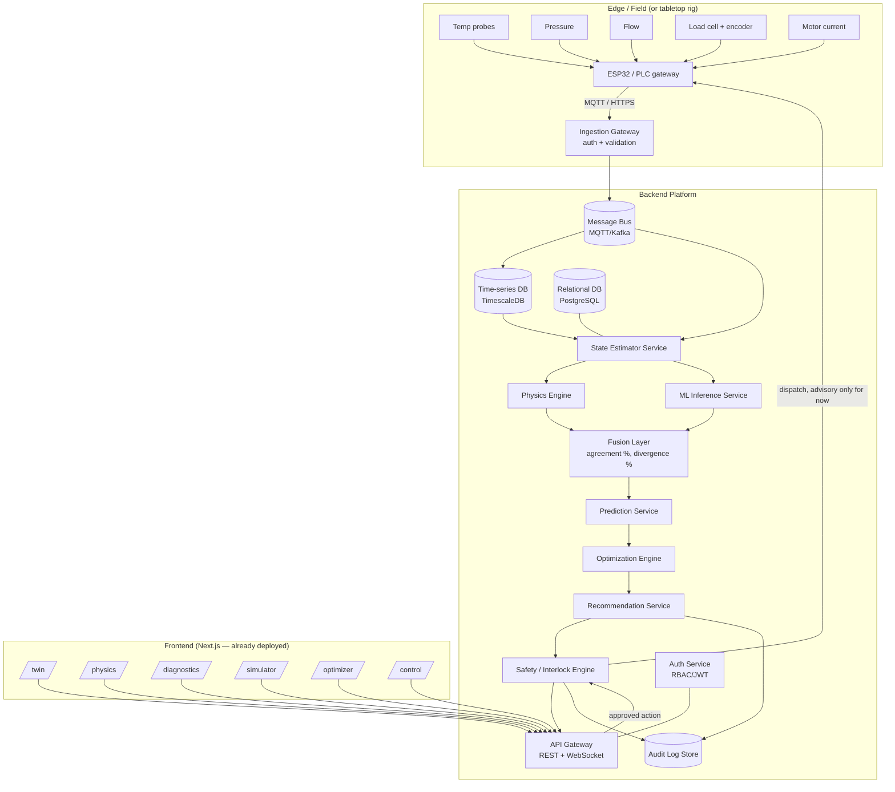
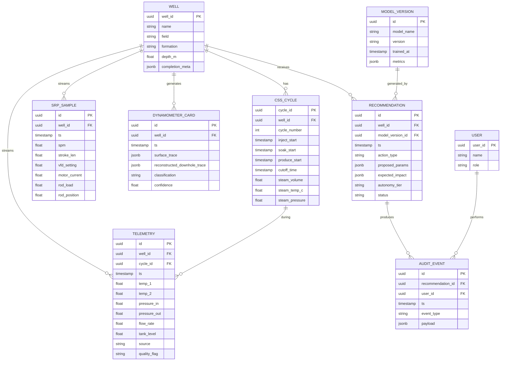

# Baghewala Well-to-Surface Digital Twin
## End-to-End Solution & Software Architecture Document

**SIH 2026 — Problem Statement 26120**
**Organization:** Oil India Limited (OIL) · **Theme:** Smart Automation · **Category:** Software
**Field:** Baghewala, Jaisalmer, Rajasthan · **Reservoir:** Jodhpur Sandstone
**Document type:** Mentor working document — problem → solution → workflow → architecture → build plan
**Companion prototype:** [tempo-twin-h8se.vercel.app](https://tempo-twin-h8se.vercel.app/) (frontend shell, currently UI-only)

---

## 0. How to use this document

You already have a frontend shell live (`/twin`, `/physics`, `/diagnostics`, `/simulator`, `/optimizer`, `/control`) with well-chosen information architecture — it just has no business logic behind it yet. This document is written so that document *is* the product spec: every backend service, model, and API described below is designed to feed **exactly those six screens** with real (or realistically-simulated) numbers instead of hard-coded ones.

Read it top to bottom once, then use it as a working reference: Section 9 (backend), Section 11 (physics), Section 12 (ML) and Section 16 (API contracts) are what your team will actually be coding from.

---

## 1. Executive Summary

Baghewala produces heavy crude (14–19° API per OIL's public material, viscosity on the order of **10,000–13,000 cP at 50°C**) from the Jodhpur Sandstone at ~1,050–1,300 m. Because the crude barely flows on its own, OIL uses **Cyclic Steam Stimulation (CSS)** — inject steam, soak, produce, repeat — to heat the reservoir and reduce viscosity, combined with **Sucker Rod Pumping (SRP)** to lift the mobilized fluid to surface.

Today CSS scheduling and SRP tuning are decided **separately**, mostly from operator experience. But they are physically coupled: as the reservoir cools between cycles, viscosity climbs back up, the rod string has to work against more drag, "rod floating" and impact loading risk rises, pump fillage drops, and production quietly degrades — while nobody is looking at CSS state and SRP state on the same screen at the same time.

**PS 26120 asks for one continuously-updated Digital Twin that closes this loop**: sense the well → estimate the state you can't directly measure (bottomhole viscosity, rod drag, fillage) → predict what happens next → recommend a safe CSS/SRP adjustment → let a human (or eventually a supervised controller) act on it → feed the outcome back in.

**Our proposed solution** is a hybrid **physics + ML twin** with four properties that matter more than any single algorithm:

1. **Well-to-surface, not CSS-vs-SRP** — one shared state model, not two dashboards.
2. **Physics-first, ML-for-the-residual** — every number the twin shows can be explained; ML only corrects what the reduced-order physics model can't capture.
3. **Advisory by default** — the system recommends inside hard safety envelopes; a human approves. Autonomy increases only through validated stages (Advisory → Supervised → Automated), never assumed.
4. **Two data modes, one pipeline** — synthetic/physics-calibrated data for the hackathon demo and physical tabletop rig; the exact same schema and API for OIL's real SCADA/historian data at deployment. Nothing about the architecture changes when real data arrives — only the source adapter.

---

## 2. Problem Statement (as issued)

| Item | Detail |
|---|---|
| PS ID | 26120 |
| Title | Digital Twin for Well-to-Surface Optimization of Cyclic Steam Stimulation (CSS) and Sucker Rod Pump (SRP) Operations for Heavy Oil Wells of Baghewala Field |
| Organization | Oil India Limited |
| Category / Theme | Software / Smart Automation |
| Crude | Heavy, ~17–19° API (PS text) |
| Reservoir | Jodhpur Sandstone; low pressure; low temperature (46–48 °C) |

**Problem, in the PS's own framing:** CSS parameters (steam volume, injection pressure, soak time, production cut-off) and SRP parameters (stroke length, SPM, VFD setting) are each tuned from historical practice, not jointly and not predictively. As reservoir temperature falls after a steam cycle, viscosity rises, pump efficiency drops, energy use climbs, and rod floating / impact loading / rod failures / pump unsetting increase. There is no system that treats reservoir + wellbore + SRP + surface as one coupled, continuously-optimized asset.

**Asked-for outcome:** an AI-enabled Well-to-Surface Digital Twin that predicts reservoir heating/cooling and production, continuously tunes SRP operation, detects rod floating and reduces impact loading, improves pump efficiency and reliability, and reduces Steam-Oil Ratio (SOR) and energy cost — with data availability stated as: production history, CSS cycle records, steam injection parameters, VFD/SRP data, rod-failure/pump-unsetting history, completion and reservoir data, fluid properties and pressure data.

**The one-sentence version we use with judges:**
> *"CSS decides how mobile the oil is. SRP decides whether that mobility actually reaches the surface without breaking the rod string. Today those two decisions are made by two different people looking at two different screens. We put them in one model."*

---

## 3. Domain Primer (what every team member must actually understand)

You don't need a petroleum engineering degree, but you do need these six ideas cold — they are what makes the twin's outputs defensible in front of judges who may include OIL engineers.

### 3.1 Why heavy oil is hard
API gravity is inversely related to density; ~17–19° API is "heavy." The dominant lever is **viscosity**, and viscosity is steeply temperature-dependent for heavy crude:

```
Temperature ↑  →  Viscosity ↓ (roughly exponentially)  →  Mobility ↑  →  Inflow / production potential ↑
```

At reservoir temperature (~46–48 °C) Baghewala crude is reported at **10,000–13,000 cP** — thousands of times more viscous than water. That is *why* CSS exists at all.

### 3.2 Cyclic Steam Stimulation (CSS) — three phases, one repeating cycle
```
INJECT (steam, days)  →  SOAK (shut-in, heat redistributes)  →  PRODUCE (declining as reservoir cools)  →  repeat
```
OIL's own published BGW-8 pilot: ~5 days injection, ~2 days soak, steam ~300 °C / ~95 kg/cm². Broader OIL documentation describes injection periods of roughly 14–21 days depending on reservoir injectivity, with soak ≈ 50% of injection time. **Treat these as reported reference points, not universal constants** — every well's cycle differs.

### 3.3 Steam-Oil Ratio (SOR) — the thermal efficiency KPI
```
SOR = Steam consumed / Oil produced        (lower is better)
```
The optimizer must never simply "maximize steam" — that raises SOR and cost even if it raises short-term oil rate.

### 3.4 Sucker Rod Pump (SRP) — the lift side
```
Motor → Gearbox/Crank → Walking Beam → Polished Rod → Sucker Rod String → Downhole Pump → Produced Fluid
```
Key controls: **SPM** (strokes/minute), **stroke length**, **VFD setting** (motor speed control). More speed ≠ more net production once you account for dynamic loading, rod drag and failure risk — the optimum is an interior point, not a boundary.

### 3.5 Rod floating, dynamic loading, and the dynamometer card
As viscosity rises (reservoir cooling) and/or SPM is too aggressive for the fluid column, the sucker rod string can go into **compression on the downstroke** instead of staying in tension — "rod floating" — which causes impact loading against the tubing and accelerates fatigue failure. This is diagnosed with a **dynamometer card**: rod load (Y) vs rod position (X) over one pumping cycle. A healthy card looks like a smooth parallelogram; floating, fluid pound, gas interference and traveling-valve leaks each distort the card shape differently. Reconstructing what happens **downhole** from what you can only measure at the **surface** load cell is a classic inverse problem solved with the **Gibbs 1-D damped wave equation** for the rod string.

### 3.6 Why "well-to-surface" is the actual ask
```
Reservoir → Wellbore → Downhole pump → Rod string → Surface equipment → Production
                    ↘ Sensors/data ↙
                      Digital Twin → AI + Optimizer → Recommendation
```
A twin that optimizes CSS alone, or SRP alone, is not what was asked for. The differentiator judges will look for is exactly this coupling.

---

## 4. Baghewala Field — Facts vs. Assumptions

Be explicit about this distinction in every deliverable — it is a trust signal to judges and to OIL.

| Category | Statement | Status | Use |
|---|---|---|---|
| Location | Baghewala, Jaisalmer district, Rajasthan; PML block ~200 km² | Publicly reported by OIL | Background |
| Discovery | Heavy crude discovered in Bikaner–Nagaur Basin, 1991 | Publicly reported | Timeline |
| Commercial production | Began 2017; CSS pilot 2006, successful CSS (BGW-8) reported ~2018 | Publicly reported | Timeline |
| Field scale | 35 wells drilled, 23 producing, field output reported >600 BOPD | Publicly reported (approximate, dated) | Context, not live |
| Reservoir | Jodhpur Sandstone, ~1,050–1,300 m; representative well BGW-4 ~1,150 m | Publicly reported | Model calibration range |
| Crude viscosity | ~10,000–13,000 cP at 50 °C | Publicly reported | Physics-layer calibration target |
| Crude gravity | Reported in different OIL materials as ~14–17° API and the PS states ~17–19° API | Range varies by source | State both, don't over-claim precision |
| Steam conditions | CSS steam ~250–320 °C; BGW-8 pilot ~300 °C / ~95 kg/cm² | Publicly reported (pilot-specific) | Thermal-layer calibration |
| **Live SCADA values, current well-by-well rates, actual cut-off economics, exact dynamometer data** | **Not public** | **Assumption / synthetic** | Must come from OIL for real deployment |

**Rule for the whole project:** anything not in the above "publicly reported" bucket is labeled *estimated*, *inferred*, or *synthetic (physics-calibrated)* everywhere it appears — in the report, in the dashboard, and out loud to judges. This is exactly the discipline your existing `sih_brief.docx` and research summary already established; keep it.

---

## 5. Proposed Solution — Product Vision

**One sentence:** A hybrid physics + ML Digital Twin that fuses CSS thermal state and SRP mechanical state into a single well model, predicts what happens next, and proposes safe, explainable, human-approved operating changes — deployed first as a software prototype against synthetic/physics-calibrated data, with an optional safe tabletop rig to prove the sensing and control loop physically.

**Five outcomes it must demonstrably deliver** (directly answering the PS's "expected outcome" list):

1. Optimized CSS cycle parameters (injection duration, soak time, cut-off timing) recommended from predicted thermal decline, not fixed schedule.
2. Predicted reservoir heating/cooling and production trajectory over the CSS cycle.
3. Continuous SRP tuning (SPM / VFD / stroke) that reacts to *predicted* viscosity, not just current readings.
4. Rod-floating detection and impact-loading minimization, using a downhole dynamometer reconstruction.
5. Lower SOR and energy-per-barrel, with an explicit ₹/day economic read-out — because "optimize" without a cost axis isn't optimization.

**Product surfaces** (mapped 1:1 onto the six pages you've already shipped):

| Page (already built) | What it must be backed by |
|---|---|
| **TWIN** | Live/replayed state estimator: observed vs. inferred (physics+ML) values, agreement %, divergence % |
| **PHYSICS** | The explainable reduced-order thermal/viscosity/mechanical model, shown as equations + curves, not a black box |
| **DIAGNOSTICS** | Surface-to-downhole dynamometer reconstruction (Gibbs wave solver) + condition classifier (floating / fluid pound / gas interference / normal) |
| **SIMULATOR** | What-if sandbox: change CSS/SRP settings, see predicted twin response before touching the real well |
| **OPTIMIZER** | Multi-objective Pareto search over {production, energy, cost, failure risk}, ranked strategies (A/B/C) with ₹/day economics |
| **CONTROL** | The safety/autonomy layer: Advisory → Supervised → Automated, interlock matrix, approve/reject workflow, audit trail |

---

## 6. System Workflow — How the Solution Operates End-to-End

### 6.1 The closed decision loop (conceptual)



This loop runs continuously (e.g., every 30–60 s for a live rig, or on each replay tick for the "Time Machine" scenario player already in your UI). **Nothing exits box G and reaches the real well without passing through H** — this is the single most important architectural invariant in the whole system, and it's why "advisory-first" is a design decision, not a disclaimer.

### 6.2 One CSS cycle, end-to-end (operational narrative)

1. **Day 0 — Steam Injection begins.** Twin ingests injection rate/pressure/temperature (or simulated equivalents). Physics layer starts integrating a thermal energy balance.
2. **Day 0–5 — Injection.** Twin's PHYSICS view shows predicted bottomhole temperature rising toward a peak; OPTIMIZER pre-computes an expected soak/production plan.
3. **Day 5–7 — Soak.** No injection; twin predicts heat redistribution and decay; SIMULATOR lets the team preview "what if we soak 1 day longer."
4. **Day 7 → cut-off — Production.** SRP starts. TWIN now fuses: predicted bottomhole viscosity (from temperature) with observed surface load/current/flow. As days pass and temperature falls, DIAGNOSTICS starts flagging rising rod-floating risk from the reconstructed downhole card.
5. **Threshold crossed.** CONTROL's interlock matrix evaluates the proposed change (e.g., "reduce downstroke velocity 17% via VFD") against all 7 hard limits. If safe, it's surfaced as an **Advisory** recommendation with expected impact (Δenergy, Δ₹/day, Δrisk).
6. **Operator approves (or the system, once validated, auto-dispatches under Supervised/Automated tier).** Action is logged with model version, inputs, and operator identity/response.
7. **Economic cut-off.** OPTIMIZER's revenue-vs-lifting/thermal-cost model flags the day marginal gross revenue stops covering marginal cost — recommending the next CSS cycle should begin, closing the loop back to step 1.

### 6.3 Maturity path (also matches your CONTROL page's three tabs)

```
Shadow Mode  →  Advisory  →  Supervised  →  Automated
(observe &     (recommend,   (recommend,     (auto-dispatch
 log only)      human must    human can pre-   inside hard
                approve each   authorize a      limits, human
                action)        class of action) can override)
```
Never claim the hackathon prototype is past "Advisory." That is itself a credibility point with an OIL jury.

---

## 7. High-Level Architecture



**Design principles behind this diagram:**
- **Physics and ML run as siblings, not a pipeline** — they both independently estimate the same quantities (e.g., bottomhole temperature), and a **Fusion Layer** reports their agreement. This is exactly the "Physics: 111.2 °C / ML Surrogate: 110 °C / 99% agreement" pattern already in your TWIN page — keep it, it's a genuinely good trust-building UX idea, formalize it as a first-class architectural component.
- **Everything an operator can approve is logged immutably** before and after action — this is what makes "advisory, not autonomous" auditable rather than just asserted.
- **The same ingestion contract serves synthetic data, the tabletop rig, and (later) OIL's SCADA/historian** — only the adapter behind the Ingestion Gateway changes.

---

## 8. Frontend Architecture

### 8.1 Recommended stack (matches what's already deployed)
- **Framework:** Next.js 14+ (App Router), TypeScript, deployed on Vercel — keep your current setup.
- **Styling/UI:** Tailwind CSS + a component library (shadcn/ui pattern) for the gauges, cards, and matrices already visible in the UI.
- **Charts:** Recharts or D3 for the Pareto scatter (OPTIMIZER), dynamometer card overlay (DIAGNOSTICS), and time-series trends (TWIN/PHYSICS).
- **Real-time data:** WebSocket client (native or `socket.io-client`) subscribed to the backend's telemetry/prediction channel; fallback to polling REST for the "replay" Time Machine mode.
- **State management:** React Query / TanStack Query for server state (telemetry, predictions, recommendations) + lightweight client state (Zustand or Context) for UI-only state (selected scenario, autonomy tier toggle, subsystem selector).

### 8.2 Page → data contract map

| Page | Primary data it needs | Refresh pattern |
|---|---|---|
| `/twin` | Current well state (observed + inferred), health %, agreement/divergence, active alerts | WS stream, ~1–5s or per replay tick |
| `/physics` | Physics-layer equations' live outputs: thermal decay curve, viscosity-temperature curve, mobility, SOR | On state change / on demand |
| `/diagnostics` | Surface dynamometer trace, Gibbs-reconstructed downhole card, condition classifier probabilities | On each pump cycle sample |
| `/simulator` | What-if endpoint: user-submitted CSS/SRP parameter set → predicted trajectory | On-demand (user-triggered POST) |
| `/optimizer` | Ranked strategies (A/B/C…), Pareto frontier points, economic cut-off curve | On demand / periodic recompute |
| `/control` | Current vs. proposed control values, interlock matrix status, approve/reject action | WS stream for interlocks, REST for approve/reject |

### 8.3 "Time Machine" / scenario replay
Your existing scenario player (Normal Ops D14, Cooling D25, Rod Floating D35, CSS Cut-off D41, Energy Min D18) is the right hackathon-safe way to always have a good demo regardless of live sensor availability. Architecturally, treat it as **a special ingestion adapter**: instead of MQTT from a rig, a "replay adapter" streams a pre-computed, physics-consistent time series into the exact same ingestion → state → prediction → optimizer pipeline. This means your demo mode and your live mode are testing the *same* backend code path — which is both good engineering and a strong technical answer if a judge asks "is this fake?"

---

## 9. Backend Architecture

### 9.1 Service breakdown

| Service | Responsibility | Suggested tech |
|---|---|---|
| **Ingestion Gateway** | Authenticate device/source, validate units & ranges, timestamp, publish to bus; also hosts the "replay adapter" for demo/synthetic mode | FastAPI + MQTT client, or a small Node/Express gateway |
| **Message Bus** | Decouple producers (edge/replay) from consumers (state, storage) | MQTT broker (Mosquitto/EMQX) for device-style topics; Kafka/Redis Streams if throughput grows |
| **Storage — Time-series** | Raw + cleaned telemetry, high write volume, range queries for charts | TimescaleDB (Postgres extension) |
| **Storage — Relational** | Wells, sensors, CSS cycles, users, recommendations, interlock definitions, model registry metadata | PostgreSQL |
| **State Estimator Service** | Fuses latest telemetry into "current state" (observed + inferred), computes physics/ML agreement & divergence | Python (FastAPI) |
| **Physics Engine** | Deterministic reduced-order model: thermal decay, viscosity-temperature, rod mechanics, SOR (see §11) | Python (NumPy/SciPy), packaged as an importable library used by both State Estimator and Simulator |
| **ML Inference Service** | Trained models for forecast, anomaly, dynamometer classification, failure risk (see §12) | Python (FastAPI) serving scikit-learn/XGBoost/LightGBM models via a model registry |
| **Prediction Service** | Short-horizon forecast combining physics trend + ML residual correction, with confidence bands | Python |
| **Optimization Engine** | Multi-objective constrained search producing ranked strategies + Pareto frontier + economic cut-off (see §13) | Python (SciPy `optimize`, or `pymoo` for NSGA-II) |
| **Safety / Interlock Engine** | Evaluates every proposed action against the hard-limit matrix; the *only* component allowed to mark an action "dispatchable" | Python, deliberately simple/rule-based (no ML in the safety path) |
| **Recommendation Service** | Packages optimizer output + interlock verdict + human-readable explanation into a single recommendation object | Python |
| **Audit Service** | Immutable append-only log of every recommendation, approval/rejection, and dispatch, with model versions | Postgres table with write-only application role, or a dedicated audit store |
| **Auth Service** | Login, roles (Operator, Engineer, Admin, Viewer), JWT issuance | FastAPI + `python-jose`, or Auth0/Clerk for hackathon speed |
| **API Gateway** | Single REST + WebSocket surface the frontend talks to; routes to internal services | FastAPI (can start as a monolith with these as internal modules, split later — see §17.4) |

> **Hackathon-pragmatic note:** you do not need nine separate deployed microservices for the demo. Build these as **clean modules inside one FastAPI monolith** with the same boundaries (own router, own Pydantic models, no cross-imports of internals), so it can be split into real services later without a rewrite. This is the single highest-leverage engineering decision you can make this week.

### 9.2 Why physics-first architecture (not "just train a model")
A judge will ask "why not just an LSTM on historical data?" Your answer: (a) you don't have Baghewala's real SCADA history yet, so an ML-only model has nothing honest to train on; (b) a physics layer is calibratable from a handful of published parameters plus rig experiments, and it is inherently explainable — you can show the equation on the PHYSICS page instead of a black box; (c) ML is used exactly where physics is weakest — residual correction, anomaly/condition classification from shapes (dynamometer cards) that are hard to hand-derive, and failure-risk pattern recognition from labeled history once OIL provides it.

---

## 10. Data Architecture

### 10.1 Core entities (ERD, simplified)



### 10.2 Sample DDL (core tables)

```sql
CREATE TABLE well (
    well_id UUID PRIMARY KEY DEFAULT gen_random_uuid(),
    name TEXT NOT NULL,
    field TEXT NOT NULL DEFAULT 'Baghewala',
    formation TEXT NOT NULL DEFAULT 'Jodhpur Sandstone',
    depth_m NUMERIC,
    completion_meta JSONB
);

CREATE TABLE css_cycle (
    cycle_id UUID PRIMARY KEY DEFAULT gen_random_uuid(),
    well_id UUID REFERENCES well(well_id),
    cycle_number INT NOT NULL,
    inject_start TIMESTAMPTZ,
    soak_start TIMESTAMPTZ,
    produce_start TIMESTAMPTZ,
    cutoff_time TIMESTAMPTZ,
    steam_volume NUMERIC,
    steam_temp_c NUMERIC,
    steam_pressure NUMERIC
);

-- Hypertable (TimescaleDB) for high-frequency telemetry
CREATE TABLE telemetry (
    id UUID DEFAULT gen_random_uuid(),
    well_id UUID REFERENCES well(well_id),
    cycle_id UUID REFERENCES css_cycle(cycle_id),
    ts TIMESTAMPTZ NOT NULL,
    temp_1 NUMERIC, temp_2 NUMERIC,
    pressure_in NUMERIC, pressure_out NUMERIC,
    flow_rate NUMERIC, tank_level NUMERIC,
    source TEXT DEFAULT 'synthetic',      -- synthetic | rig | scada
    quality_flag TEXT DEFAULT 'ok'        -- ok | missing | out_of_range | quarantined
);
SELECT create_hypertable('telemetry', 'ts');

CREATE TABLE recommendation (
    id UUID PRIMARY KEY DEFAULT gen_random_uuid(),
    well_id UUID REFERENCES well(well_id),
    model_version_id UUID,
    ts TIMESTAMPTZ DEFAULT now(),
    action_type TEXT NOT NULL,             -- e.g. 'vfd_downstroke_damping'
    proposed_params JSONB NOT NULL,
    expected_impact JSONB,                 -- {"energy_pct": -8.3, "risk_pct": -29.4, "value_inr_day": 38000}
    autonomy_tier TEXT NOT NULL DEFAULT 'advisory',
    status TEXT NOT NULL DEFAULT 'pending' -- pending | approved | rejected | dispatched
);

CREATE TABLE audit_event (
    id UUID PRIMARY KEY DEFAULT gen_random_uuid(),
    recommendation_id UUID REFERENCES recommendation(id),
    user_id UUID,
    ts TIMESTAMPTZ DEFAULT now(),
    event_type TEXT NOT NULL,              -- created | approved | rejected | dispatched | interlock_block
    payload JSONB
);
```

### 10.3 Data-quality discipline
Every incoming reading is tagged `ok / missing / out_of_range / quarantined` at ingestion — **never silently coerced into a trusted value.** Downstream services (physics, ML, optimizer) must refuse to act on quarantined inputs and instead flag "insufficient sensor quality" on the relevant dashboard card. This one rule is what separates a demo toy from something an OIL engineer could imagine trusting.

---

## 11. Physics Engine (the explainable core)

All of these are **reduced-order, calibratable models** — not a full reservoir simulator (that's CMG STARS territory, out of scope for a software-track hackathon prototype, and explicitly flagged as such to judges).

### 11.1 Thermal decay (reservoir cooling after soak)
Simple lumped energy-balance / Newton-cooling form, calibrated per well:
```
T(t) = T_ambient + (T_peak − T_ambient) · e^(−t / τ)
```
where `τ` (thermal decay time constant) is fit from either published CSS behavior or rig experiments (Experiment B/C in your original plan). Shown directly on `/physics` as the live decay curve with current `dT/dt`.

### 11.2 Viscosity–temperature correlation
Heavy-oil viscosity is well-approximated by an Arrhenius/Andrade-type exponential relationship:
```
μ(T) = μ_ref · exp[ B · (1/T − 1/T_ref) ]
```
Fit `μ_ref`, `B` against the two published anchor points (≈10,000–13,000 cP at 50 °C) plus any rig-measured glycerol/silicone-oil analogue curve. This is your `μ = f(T)` calibrated relationship, shown as a curve on `/physics`, and it's the single most important equation in the whole system — everything downstream (mobility, rod drag, SOR) is gated by it.

### 11.3 Mobility / inflow proxy
```
Mobility(T) ∝ 1 / μ(T)          Inflow(t) ≈ k · Mobility(T(t)) · ΔP(t)
```
`k` and `ΔP` are calibration/assumption parameters, explicitly labeled as such until real reservoir pressure data is available.

### 11.4 Rod mechanics & the Gibbs wave equation (downhole reconstruction)
The sucker rod string is modeled as a damped 1-D wave equation along its length `x` and time `t`:
```
∂²u/∂t² = c² · ∂²u/∂x² − 2ξ · ∂u/∂t
```
where `u(x,t)` is rod displacement, `c` is the wave speed in steel (~16,300 ft/s, a standard API value), and `ξ` is a damping coefficient dominated by **fluid viscous drag** — which is exactly why it's temperature/viscosity-dependent and why CSS state feeds directly into the DIAGNOSTICS page. Solved numerically (finite-difference along the rod length) with the **surface** load/position trace as the boundary condition, to reconstruct the **downhole** card. This is a well-established technique in real SRP diagnostics (the "Gibbs method"); implementing a simplified finite-difference version is realistic for a software-track team and is the technical core of your DIAGNOSTICS page.

### 11.5 Rod-floating risk index
A composite, explainable score rather than a raw ML output — this matters for defensibility:
```
RiskIndex = w1·(ViscousDrag / BuoyantWeight) + w2·(ΔCompressionMargin) + w3·(dT/dt trend)
```
normalized to 0–100%, thresholds at Warn (~45%) / Critical (~75%) — matching the gauge already in your TWIN page.

### 11.6 Steam-Oil Ratio & energy per barrel
```
SOR(t) = CumulativeSteamVolume / CumulativeOilProduced
Energy_per_bbl = (Thermal energy delivered + Pumping energy) / Oil produced
```

### 11.7 Economic scoring (feeds OPTIMIZER)
```
NetValue(₹/day) = GrossRevenue(₹/day) − LiftingEnergyCost(₹/day) − ThermalCost(₹/day) − RiskAdjustedMaintenanceCost(₹/day)
```
Oil price, energy tariff, and steam generation cost are configuration parameters (from OIL, or reasonable public benchmarks clearly labeled as assumptions for the demo) — never hard-coded silently into the model.

---

## 12. AI/ML Layer

Start every model with the **prediction/control question**, not a model name (per your own research summary — this is correct and worth keeping as a team motto).

| Module | Question it answers | Inputs | Candidate algorithm | Output | Eval metric |
|---|---|---|---|---|---|
| **Production forecaster** | What will oil rate be in the next 6–24h? | CSS state, temp trend, SRP settings, lagged production | Gradient boosting (XGBoost/LightGBM) → optionally a small temporal model if enough clean series exist | Forecast + confidence band | MAE/RMSE vs. naive-persistence baseline |
| **Viscosity residual corrector** | How far off is the physics `μ=f(T)` estimate from observed behavior? | Physics-predicted μ, observed rod drag/current signature | Simple regression (Ridge/GBR) correcting physics output | Corrected μ estimate | Residual reduction vs. physics-only |
| **Dynamometer condition classifier** | Normal / rod floating / fluid pound / gas interference / traveling-valve leak? | Reconstructed downhole card shape features (area, slope segments, min/max load) | Random Forest or small CNN on the card image/curve | Class + probability | Precision/recall per class on labeled/injected-fault data |
| **Failure-risk model** | Rod/pump failure probability over next N days? | SPM, stroke, load history, vibration, cycle count, prior failures | XGBoost / survival-analysis style model once failure history exists | Risk probability | AUC, calibration curve |
| **Anomaly / sensor-health detector** | Is a reading trustworthy? | Cross-sensor residuals, rate-of-change, missingness | Rule-based + Isolation Forest | Anomaly score, quarantine flag | Precision/recall on injected faults |

### 12.1 MLOps discipline (small but real)
- **Model registry**: every trained model gets a `model_version_id`, stored with its training data window, hyperparameters and metrics (the `MODEL_VERSION` table in §10). Every recommendation is traceable to exactly the model version that produced it.
- **Shadow evaluation before promotion**: a new model version runs alongside the current one, logging predictions without affecting recommendations, until its error is measured against the incumbent.
- **Drift monitoring**: track physics/ML divergence (the same metric shown on `/twin`) over time — a sustained rise is your own drift signal.
- **Confidence gating**: the Safety/Interlock Engine treats "Model Confidence Threshold" as a hard limit (already in your CONTROL page's 7-item matrix at 75%) — recommendations below threshold are suppressed, not just flagged.

### 12.2 Training data strategy for the hackathon
You don't have OIL's real historian data yet. Build a **physics-informed synthetic dataset**: run the physics engine (§11) across plausible CSS cycles with injected noise and occasional simulated faults (rod floating, sensor dropout, leak), label the fault windows, and train/evaluate ML models on that. This is explicitly the strategy your own research summary already recommended — it's the right call, and it's honest to present as "physics-calibrated synthetic data, architecture identical to what would ingest OIL's SCADA."

---

## 13. Optimization Engine

### 13.1 Formulation
Multi-objective, constrained. Decision variables: CSS `{steam_volume, injection_duration, soak_time, cutoff_trigger}` and SRP `{SPM, stroke_length, VFD_setting}`.

```
maximize   f(x) = [ Production(x), −SOR(x), −Energy(x), −FailureRisk(x), NetValue(x) ]
subject to  SPM ≤ SPM_max
            MotorCurrent(x) ≤ I_max
            PeakRodLoad(x) ≤ PPRL_max
            MinDownstrokeTension(x) ≥ T_min
            WellheadPressure(x) ≤ P_max
            ModelConfidence ≥ 75%
```

### 13.2 Method
- For the hackathon: a **weighted-sum / epsilon-constraint sweep** over the feasible grid is enough to produce a Pareto frontier (Strategy A/B/C style clusters), computed fast enough for interactive `/optimizer` use.
- For a stronger technical story: **NSGA-II** (via `pymoo`) for genuine multi-objective Pareto search — still fast enough to run on demand, and lets you say "genetic algorithm" credibly to a judge instead of just "we picked three points."
- Constraints are evaluated by the **same Safety/Interlock Engine** used by the Control layer — the optimizer must never propose something the interlocks would block; this consistency is itself something to point out in your pitch.

### 13.3 Output shape (feeds `/optimizer` directly)
```json
{
  "strategies": [
    {"name": "Strategy A", "label": "Maximum Gross Recovery (High SPM)",
     "production_bopd": 40, "energy_kwh_day": 48.2, "rod_risk_pct": 52,
     "cost_inr_day": 118000, "net_value_inr_day": 130000},
    {"name": "Strategy B", "label": "Balanced Production & Reliability",
     "production_bopd": 34, "energy_kwh_day": 38.6, "rod_risk_pct": 18,
     "cost_inr_day": 89000, "net_value_inr_day": 122000},
    {"name": "Strategy C", "label": "Minimum Energy & Mechanical Stress",
     "production_bopd": 29, "energy_kwh_day": 29.4, "rod_risk_pct": 9,
     "cost_inr_day": 69000, "net_value_inr_day": 111000, "recommended": true}
  ],
  "pareto_frontier": [{"cost_inr_day": 69000, "production_bopd": 29, "risk_pct": 9}, "..."],
  "economic_cutoff_day": 41
}
```

---

## 14. Decision & Control Layer (Safety-Critical Design)

### 14.1 Autonomy tiers
| Tier | Behavior | Who's responsible |
|---|---|---|
| **Advisory** (default / hackathon scope) | System recommends; nothing is dispatched without explicit human approval per action | Operator |
| **Supervised** | Operator pre-authorizes a *class* of actions (e.g., "auto-approve VFD changes < 10%"); system dispatches within that envelope, still logged and revocable | Operator + system |
| **Automated** (future, post field-validation) | System dispatches inside hard limits automatically; human can override/halt at any time | System, with human override authority retained |

### 14.2 Interlock matrix (hard limits — rule-based, no ML in this path)
Directly matching your CONTROL page's seven interlocks:

| Interlock | Example limit |
|---|---|
| Maximum SPM | 8.0 SPM |
| Motor current peak | 55.0 A |
| Peak Polished Rod Load (PPRL) | 24,000 lb |
| Minimum downstroke tension | 2,000 lb |
| Critical wellhead pressure | 500 psi |
| Model confidence threshold | 75% |
| SCADA/telemetry link health | 80% |

**Design rule:** the Safety/Interlock Engine is intentionally the simplest, most deterministic, most heavily-tested component in the system. It never calls the ML service; it only reads current/predicted values and compares against static, engineer-set thresholds. This separation (learned components propose, deterministic component gates) is standard practice in safety-relevant automation and is worth stating explicitly to judges.

### 14.3 Approval workflow
```
Recommendation created → interlock check (auto) → surfaced to operator with explanation
   → Operator: Approve → dispatch (or simulate, in demo mode) → audit_event(dispatched)
   → Operator: Reject  → audit_event(rejected, reason)
   → Timeout/No action → recommendation expires, audit_event(expired)
```
Every branch is logged. This is what turns "human-in-the-loop" from a slide bullet into a testable system property.

---

## 15. Hardware Prototype Bridge (optional but recommended for the demo)

You already scoped this well in `sih_brief.docx`/`SIH-120.pdf` — keep the safety boundaries **exactly as written there**: no real steam, no real crude, low-voltage indirect heating only, independent thermal cutoffs, emergency stop, water/glycerol viscosity surrogate. Architecturally, the rig is just another producer into the Ingestion Gateway:

```
[Water-glycerol reservoir + indirect heater] → [Mini SRP: motor+crank+load cell+encoder]
        → [ESP32: reads sensors, enforces local fail-safe, publishes MQTT]
        → Ingestion Gateway → (same pipeline as §7)
```

**Minimum viable sensor set** (from your own BOM, still correct): 2–3 temperature probes, 1 low-pressure transducer, 1 flow sensor, rotary encoder (rod position/SPM), load cell (rod load), current sensor, tank level. This is exactly enough to populate the TWIN, DIAGNOSTICS and CONTROL pages with **real, not simulated,** numbers for at least the mechanical/thermal-response half of the story — a strong differentiator versus teams with slideware only.

If the rig isn't ready in time, the "replay adapter" from §8.3 lets the whole backend run identically off pre-computed physics-consistent scenarios. Build the rig as a stretch goal, not a dependency.

---

## 16. API Reference (contract for frontend ↔ backend)

### 16.1 REST endpoints (representative)

```
GET  /api/v1/wells/{well_id}/state
     → current fused state (observed + inferred), health%, agreement%, divergence%

GET  /api/v1/wells/{well_id}/telemetry?from=&to=&metric=
     → time-series for charts (TWIN/PHYSICS)

GET  /api/v1/wells/{well_id}/dynamometer/latest
     → surface trace, reconstructed downhole trace, classification + confidence

POST /api/v1/wells/{well_id}/simulate
     body: { css_params: {...}, srp_params: {...}, horizon_hours: 24 }
     → predicted trajectory (for SIMULATOR page)

GET  /api/v1/wells/{well_id}/optimize
     → { strategies: [...], pareto_frontier: [...], economic_cutoff_day }

GET  /api/v1/wells/{well_id}/recommendations?status=pending
POST /api/v1/recommendations/{id}/approve
POST /api/v1/recommendations/{id}/reject
     body: { reason: string }

GET  /api/v1/wells/{well_id}/interlocks
     → current status of all 7 interlocks (armed/tripped, current vs limit)

GET  /api/v1/scenarios
     → list of Time Machine replay scenarios
POST /api/v1/scenarios/{id}/play  { speed: 1|2|5 }
```

### 16.2 WebSocket channels
```
ws://.../ws/wells/{well_id}/telemetry       -- streaming sensor + inferred state, ~1-5s tick
ws://.../ws/wells/{well_id}/interlocks      -- push on any interlock status change
ws://.../ws/wells/{well_id}/recommendations -- push when a new recommendation is created
```

### 16.3 Example payload — `GET /state`
```json
{
  "well_id": "BGW-08",
  "css_cycle": 4,
  "day": 25.0,
  "phase": "production",
  "observed": { "surface_temp_c": 68.4, "flow_bopd": 34, "motor_current_a": 52.5 },
  "inferred": {
    "bottomhole_temp_c": {"value": 111.24, "trend_c_per_day": -2.1, "confidence": 0.93},
    "viscosity_cp": {"value": 10600, "trend_pct": 11.4, "confidence": 0.83},
    "rod_drag_lb": {"value": 7703, "trend_pct": 8.2, "confidence": 0.91},
    "downhole_fillage_pct": {"value": 92, "confidence": 0.92}
  },
  "fusion": { "agreement_pct": 99, "divergence_pct": 2.9, "physics_c": 111.2, "ml_c": 110.0 },
  "rod_floating_risk_pct": 43,
  "health_pct": 89
}
```

---

## 17. DevOps & Deployment

### 17.1 Environments
| Env | Purpose | Notes |
|---|---|---|
| `local` | Dev on laptop | `docker-compose up` brings up Postgres/TimescaleDB, MQTT broker, backend, frontend |
| `staging` | Judge-facing demo, integration testing | Mirrors prod, seeded with replay scenarios |
| `production` (post-hackathon) | Pilot with OIL, real/rig data | Stricter network policy, real auth, monitoring |

### 17.2 Containerization (dev/staging)
```yaml
# docker-compose.yml (excerpt)
services:
  timescaledb:
    image: timescale/timescaledb:latest-pg16
  mqtt-broker:
    image: eclipse-mosquitto:2
  backend:
    build: ./backend
    environment:
      - DATABASE_URL=postgresql://...
      - MQTT_BROKER=mqtt-broker:1883
    ports: ["8000:8000"]
  frontend:
    build: ./frontend
    environment:
      - NEXT_PUBLIC_API_URL=http://backend:8000
    ports: ["3000:3000"]
```

### 17.3 CI/CD (GitHub Actions, representative)
```
on: [push, pull_request]
jobs:
  backend-test:   pytest + ruff/lint + physics-model unit tests (equations must match known reference points)
  frontend-test:  eslint + type-check + component tests
  build-images:   docker build & push (on main)
  deploy-staging: on merge to main → deploy backend (Render/Railway/Fly.io) + frontend already on Vercel
```

### 17.4 Deployment targets
- **Frontend:** stays on **Vercel** — already correctly chosen, zero change needed.
- **Backend (hackathon-fast option):** Render / Railway / Fly.io — one-click Postgres + container deploy, minutes not days.
- **Backend (path to production/pilot):** containerized services on a managed Kubernetes (EKS/AKS) or simpler managed-container service, with the monolith-with-clean-module-boundaries from §9.1 split into real services only once there's an operational reason to (independent scaling, independent deploy cadence) — don't split early for its own sake.
- **Time-series DB:** managed TimescaleDB Cloud, or self-hosted Postgres+Timescale extension on the same instance as the app DB for the hackathon.

### 17.5 Observability
- **Metrics:** Prometheus + Grafana (or your platform's built-in metrics) tracking: ingestion lag, prediction latency, physics/ML divergence trend, interlock trip counts, recommendation approval rate.
- **Logging:** structured JSON logs from every service; correlate by `well_id` + `request_id`.
- **Alerting:** on sustained sensor quarantine, on divergence exceeding threshold, on any interlock trip — separate from the *operational* alerts already shown in the UI's "ALERTS" panel.

---

## 18. Security & Compliance Notes

- **AuthN/AuthZ:** JWT-based auth, RBAC roles — `Viewer` (read-only dashboards), `Operator` (approve/reject recommendations), `Engineer` (edit interlock thresholds, calibrate physics parameters), `Admin`.
- **IT/OT separation (for real deployment):** the Ingestion Gateway should sit in a DMZ-style segment; it must never have write access back into OIL's SCADA/PLC network — the Safety/Interlock Engine's "dispatch" action, in a real deployment, would go through OIL's own control-system change-management process, not a direct API call from this system. Say this explicitly to judges; it shows you understand OT security is not the same as IT security.
- **Data protection:** encrypt in transit (TLS everywhere, including MQTT via TLS), encrypt sensitive config/secrets at rest (or use a secrets manager — even a hackathon can use `.env` + Vercel/Render secret stores instead of committing keys).
- **Audit immutability:** the audit log table should be append-only at the application role level (`GRANT INSERT, SELECT` only, no `UPDATE/DELETE`) — a small detail that materially strengthens your "human accountability" story.

---

## 19. Testing & Validation Strategy

| Stage | What's tested | Pass evidence |
|---|---|---|
| 1. Physics unit tests | Equations in §11 reproduce known reference points (e.g., viscosity curve hits ~10,000–13,000 cP at 50 °C) | Automated test asserting within tolerance |
| 2. Sensor/rig bench test | Each physical sensor vs. reference instrument | Calibration sheet, error, repeatability |
| 3. Thermal response test | Controlled heat/no-heat runs on rig or replay | Temperature/flow proxy respond as physics predicts |
| 4. Fault injection | Disconnect sensor, simulate leak/overheat/rod-floating | Correct alarm, correct interlock trip, safe-state entered, event logged |
| 5. Forecast backtest | Train/validate on time-separated synthetic runs | Held-out error beats naive-persistence baseline |
| 6. Shadow optimization | Recommendations generated but never auto-dispatched | Operator review log, no unauthorized action ever recorded |
| 7. End-to-end demo rehearsal | Full loop, ingestion → dashboard → approval → (simulated) dispatch | Live walkthrough matches Section 20 script |

**Explicit non-claims** (state these up front, don't let a judge "catch" you): this validates the *architecture and logic*, not Baghewala reservoir performance, not real field economics, not actual well integrity, and not field-control readiness. Real deployment requires OIL-approved historian data, engineering review, HAZOP/management-of-change, and a controlled shadow-mode pilot before any Supervised/Automated tier is considered.

---

## 20. Tech Stack Summary

| Layer | Choice | Why |
|---|---|---|
| Frontend | Next.js + TypeScript + Tailwind, on Vercel | Already built, keep it |
| Charts | Recharts / D3 | Pareto plots, dynamometer overlays, time-series |
| Backend API | Python + FastAPI | Fast to build, native fit for physics/ML code, async WebSocket support |
| Physics | NumPy / SciPy | Deterministic, testable, explainable |
| ML | scikit-learn, XGBoost / LightGBM | Strong tabular performance, fast to train on synthetic data, explainable feature importance |
| Optimization | SciPy `optimize`, `pymoo` (NSGA-II) | Constrained + multi-objective, credible "genetic algorithm" story |
| Message bus | MQTT (Mosquitto/EMQX) | Standard for device telemetry, matches ESP32 rig |
| Time-series storage | TimescaleDB | Postgres-compatible, purpose-built for telemetry |
| Relational storage | PostgreSQL | Wells, cycles, recommendations, audit |
| Edge controller | ESP32 | Cheap, Wi-Fi/MQTT native, enough I/O for sensor plan |
| Auth | JWT / RBAC (or Auth0/Clerk for speed) | Simple, standard |
| CI/CD | GitHub Actions | Free, integrates with Vercel/Render |
| Backend hosting | Render / Railway / Fly.io (hackathon) → managed containers (pilot) | Fast to ship now, credible growth path |
| Observability | Prometheus + Grafana | Standard, OIL-familiar (industrial teams already know Grafana-style dashboards) |

---

## 21. Implementation Roadmap

### Phase 1 — Hackathon build (5 weeks, extends your existing plan)
| Week | Deliverable |
|---|---|
| 1 | Freeze requirements per this doc; DB schema live; physics equations coded + unit-tested; API contract (§16) frozen so frontend/backend can build in parallel |
| 2 | Ingestion Gateway + replay adapter working; TimescaleDB storing synthetic telemetry; `/twin` wired to real backend state (no more hard-coded numbers) |
| 3 | ML models trained on physics-informed synthetic data; `/physics` and `/diagnostics` wired; Gibbs-wave downhole reconstruction working on at least the replay scenarios |
| 4 | Optimization engine + interlock engine live; `/optimizer` and `/control` wired end-to-end; approval workflow + audit log functioning |
| 5 | Full rehearsal against Section 20 demo script; (stretch) tabletop rig streaming real sensor data into the same pipeline; polish, load-test the demo path |

### Phase 2 — Post-hackathon pilot readiness (if selected)
- Formal data-sharing agreement with OIL for historical CSS/SRP/production/failure records
- Recalibrate physics layer against real Baghewala parameters; retrain ML on real labeled failure history
- Security review for OT-adjacent deployment; HAZOP-style review of any Supervised-tier automation
- Shadow-mode pilot on a small number of wells, with OIL engineers as the approval authority

### Phase 3 — Scale
- Extend from single-well twin to multi-well fleet view
- Extend architecture to other thermal EOR methods OIL is evaluating (e.g., SAGD) without redesigning the core loop — only the physics module changes

---

## 22. Team Roles & Responsibilities

| Role | Owns | Primary deliverable in this doc |
|---|---|---|
| Petroleum/domain lead | CSS/SRP correctness, assumption discipline (§3, §4) | Keeps every number honestly labeled |
| Chemical/process lead | Viscosity-temperature calibration, heat transfer (§11.1–11.3) | Physics engine core |
| Mechanical lead | Rod dynamics, dynamometer, rig SRP mechanism | §11.4, §15 |
| Electronics/embedded lead | ESP32 firmware, sensor plan, local fail-safe | §15 |
| Backend/software lead | Services, DB, API (§9, §10, §16) | Ingestion → storage → services |
| AI/ML lead | Models, training data, MLOps (§12) | Prediction/classification/failure models |
| Optimization lead | Multi-objective search, economics (§13) | `/optimizer` logic |
| Frontend lead | Wiring the six existing pages to real APIs (§8) | No new pages needed — integration, not invention |
| Safety/QA lead | Interlock matrix, fault injection, validation plan (§14, §19) | Test evidence for judges |
| DevOps | CI/CD, deployment, observability (§17) | Reliable live demo |

---

## 23. Demo Script for Judges (5–7 minutes)

1. **Open on `/twin`, idle/normal scenario (D14).** State the one-liner from §2. Point at the Physics/ML agreement number — "we don't just show you a number, we show you two independent estimates and how much they agree."
2. **Jump Time Machine to D25 (Cooling).** Show bottomhole temperature and viscosity climbing on `/physics`, and rod-floating risk rising on `/twin`.
3. **Go to `/diagnostics`.** Walk through the surface card → Gibbs-reconstructed downhole card → condition classifier flagging rising rod-floating probability. Explain *why* (viscous drag, compression sag) in one sentence each.
4. **Go to `/simulator`.** Change a CSS/SRP parameter live, show the predicted trajectory update.
5. **Go to `/optimizer`.** Show Strategy A/B/C, the Pareto frontier, and the ₹/day economic read-out. Explain why the "recommended" strategy isn't the max-production one — this is the multi-objective story.
6. **Go to `/control`.** Show the interlock matrix (all 7 armed), the proposed VFD change, and **explicitly click Approve** — narrate that nothing dispatches without this human step, and every click is in the audit log.
7. **Jump to D35 (Rod Floating) or D41 (Cut-off)** to show the economic cut-off recommendation closing the loop back to the next CSS cycle.
8. **Close** with the maturity path (§6.3) and the one-paragraph pitch from your own research summary — it's well-written, reuse it.

---

## 24. Risks, Assumptions, and What We Are Explicitly Not Claiming

- We are **not** claiming to reproduce Baghewala's actual reservoir performance — the physics layer is a calibratable reduced-order model, not CMG STARS.
- We are **not** claiming any percentage production/SOR/cost improvement as an *achieved* result — only as a modeled, labeled projection pending real field validation.
- We are **not** proposing autonomous control of a live well in this scope — every action requires human approval at the current (Advisory) tier.
- We are **not** using real crude oil, real steam, or real well pressures in any physical prototype — safety boundaries in §15 are non-negotiable.
- **Key dependency:** the single biggest lever on how "real" this system can become is OIL sharing actual historical CSS/SRP/production/failure data — the architecture is built so that becomes a data-source swap, not a redesign.

---

## 25. SDG Alignment

| Rank | SDG | Why it fits |
|---|---|---|
| 1 | SDG 7 — Affordable & Clean Energy | Lower SOR and energy-per-barrel directly reduce energy intensity of production |
| 2 | SDG 9 — Industry, Innovation & Infrastructure | AI-enabled digital twin as industrial modernization of legacy thermal-EOR operations |
| 3 | SDG 12 — Responsible Consumption & Production | More efficient use of steam, energy, and existing production infrastructure |

(SDG 13 — Climate Action — only as a secondary claim, and only if/when a defensible emissions calculation is done; don't lead with it.)

---

## 26. Glossary

| Term | Meaning |
|---|---|
| CSS | Cyclic Steam Stimulation — inject/soak/produce thermal EOR cycle |
| SRP | Sucker Rod Pump — reciprocating artificial lift system |
| SPM | Strokes Per Minute (pump speed) |
| VFD | Variable Frequency Drive — motor speed control |
| SOR | Steam-Oil Ratio — steam consumed / oil produced |
| API gravity | Density-based crude classification; lower = heavier |
| PPRL | Peak Polished Rod Load |
| Dynamometer card | Rod load vs. rod position plot over one pump cycle |
| Rod floating | Rod string going into compression instead of tension, causing impact loading |
| Fillage | Fraction of pump barrel actually filled with fluid per stroke |
| Twin divergence | Disagreement % between physics-model and ML-model estimates of the same quantity |

---

## 27. Reference Sources

- Oil India Limited — Rajasthan Fields / Baghewala overview: https://www.oil-india.com/hi/node/4588
- Oil India Limited — OIL News, Vol. 43 No. 7 (CSS/BGW-8 context): https://www.oil-india.com/files/publications_documents/OIL_News_Vol_43_No7.pdf
- Oil India Limited — Rajasthan procurement documents (Baghewala heavy-oil/SRP context): oil-india.com procurement portal
- CMG STARS thermal reservoir simulator (reference only, out of scope for prototype): https://www.cmgl.ca/solutions/software/stars/
- Directorate General of Hydrocarbons (DGH): https://dghindia.gov.in/
- Project prototype (this team): https://tempo-twin-h8se.vercel.app/

---

*This document is a living spec — as your team calibrates the physics engine against rig data or receives real OIL data, update §4 and §11 first; everything downstream (ML training data, optimizer economics, dashboard numbers) should flow from those two sections without touching the architecture.*
