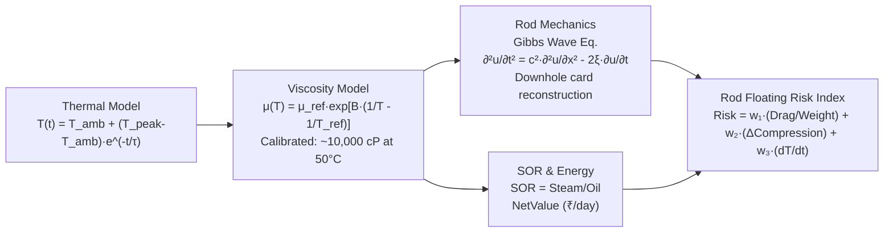
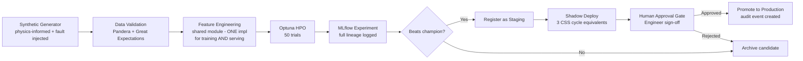

# Baghewala Digital Twin — Production Backend & ML Architecture

> **SIH 2026 · PS-26120 · Oil India Limited**
> Complete production-level implementation built from both architecture documents.

---

## What Was Built

**62 files** across the complete backend + ML stack — organized into 7 functional layers, all at `D:\Tempo_Twin\backend\`.

---

## Layer 1 — Core Infrastructure

| File | Purpose |
|---|---|
| [`pyproject.toml`](file:///D:/Tempo_Twin/backend/pyproject.toml) | Full dependency spec: FastAPI, TimescaleDB, MLflow, MQTT, pymoo, LightGBM, XGBoost, SHAP, Evidently |
| [`app/config.py`](file:///D:/Tempo_Twin/backend/app/config.py) | Pydantic Settings — all env vars with validation and defaults |
| [`app/main.py`](file:///D:/Tempo_Twin/backend/app/main.py) | FastAPI app factory: CORS, GZip, Prometheus metrics, lifespan, all routers wired |
| [`app/database.py`](file:///D:/Tempo_Twin/backend/app/database.py) | SQLAlchemy 2.0 async engine + `init_db()` that creates TimescaleDB hypertables |
| [`app/models.py`](file:///D:/Tempo_Twin/backend/app/models.py) | All 10 ORM models: Well, CssCycle, Telemetry, SrpSample, DynamometerCard, Recommendation, AuditEvent, ModelVersion, User, DatasetVersion |
| [`app/schemas.py`](file:///D:/Tempo_Twin/backend/app/schemas.py) | All Pydantic v2 request/response schemas (WellStateResponse, OptimizationResponse, etc.) |
| [`app/dependencies.py`](file:///D:/Tempo_Twin/backend/app/dependencies.py) | JWT auth, RBAC, Redis dependency providers |
| [`app/mqtt_client.py`](file:///D:/Tempo_Twin/backend/app/mqtt_client.py) | Async MQTT subscriber (aiomqtt) with reconnect and WebSocket bridge |
| [`app/websocket_manager.py`](file:///D:/Tempo_Twin/backend/app/websocket_manager.py) | Channel-based WebSocket manager for 3 channels (telemetry, interlocks, recommendations) |

---

## Layer 2 — API Routers (11 routers = 6 frontend pages + auth + WebSocket)

| Router | File | Feeds |
|---|---|---|
| Auth | [`routers/auth.py`](file:///D:/Tempo_Twin/backend/app/routers/auth.py) | Login, register, JWT refresh |
| Wells + State | [`routers/wells.py`](file:///D:/Tempo_Twin/backend/app/routers/wells.py) | `/twin` — `GET /wells/{id}/state` returns fused WellStateEstimate |
| Telemetry | [`routers/telemetry.py`](file:///D:/Tempo_Twin/backend/app/routers/telemetry.py) | `/twin` time-series charts |
| Physics | [`routers/physics.py`](file:///D:/Tempo_Twin/backend/app/routers/physics.py) | `/physics` — thermal curve, viscosity curve, energy balance |
| Diagnostics | [`routers/diagnostics.py`](file:///D:/Tempo_Twin/backend/app/routers/diagnostics.py) | `/diagnostics` — dynamometer cards + rod floating risk |
| Simulator | [`routers/simulator.py`](file:///D:/Tempo_Twin/backend/app/routers/simulator.py) | `/simulator` — what-if POST with CSS/SRP params |
| Optimizer | [`routers/optimizer.py`](file:///D:/Tempo_Twin/backend/app/routers/optimizer.py) | `/optimizer` — Pareto frontier, 3 strategies, economic cut-off |
| Control | [`routers/control.py`](file:///D:/Tempo_Twin/backend/app/routers/control.py) | `/control` — interlock matrix, autonomy tier |
| Recommendations | [`routers/recommendations.py`](file:///D:/Tempo_Twin/backend/app/routers/recommendations.py) | Approve/reject with immutable audit trail |
| Scenarios | [`routers/scenarios.py`](file:///D:/Tempo_Twin/backend/app/routers/scenarios.py) | Time Machine replay (5 pre-built scenarios) |
| WebSocket | [`routers/ws.py`](file:///D:/Tempo_Twin/backend/app/routers/ws.py) | Live push: telemetry, interlocks, recommendations |

---

## Layer 3 — Physics Engine (explainable core, no ML)



| File | Model | Key Equation |
|---|---|---|
| [`physics/thermal.py`](file:///D:/Tempo_Twin/backend/app/services/physics/thermal.py) | Thermal decay | `T(t) = T_amb + (T_peak-T_amb)·exp(-t/τ)` |
| [`physics/viscosity.py`](file:///D:/Tempo_Twin/backend/app/services/physics/viscosity.py) | Andrade/Arrhenius | `μ(T) = μ_ref·exp[B·(1/T_K - 1/T_ref_K)]` |
| [`physics/rod_mechanics.py`](file:///D:/Tempo_Twin/backend/app/services/physics/rod_mechanics.py) | Gibbs wave solver | FD solution of `∂²u/∂t² = c²·∂²u/∂x² - 2ξ·∂u/∂t` |
| [`physics/sor_energy.py`](file:///D:/Tempo_Twin/backend/app/services/physics/sor_energy.py) | SOR + economics | `NetValue = Revenue - LiftingCost - ThermalCost - RiskMaintenanceCost` |
| [`physics/rod_floating_risk.py`](file:///D:/Tempo_Twin/backend/app/services/physics/rod_floating_risk.py) | Risk composite | `Risk = w₁·(Drag/Weight) + w₂·(ΔCompression) + w₃·(dT/dt)` |

---

## Layer 4 — State Estimator (fusion core)

[`services/state_estimator.py`](file:///D:/Tempo_Twin/backend/app/services/state_estimator.py)

```
Physics Engine ──→┐
                   ├→ Fusion Layer (inverse-variance weighted average) → WellStateEstimate
ML Inference ─────┘
    fused = (phys/σ_phys² + ml/σ_ml²) / (1/σ_phys² + 1/σ_ml²)
    agreement_pct = 100 - |phys - ml|/fused × 100
```

Returns the exact `WellStateEstimate` shape from `GET /wells/{id}/state`:
```json
{ "observed": {...}, "inferred": { "bottomhole_temp_c": {value, trend, confidence}, ... },
  "fusion": { "agreement_pct": 99, "divergence_pct": 2.9 }, "rod_floating_risk_pct": 43 }
```

---

## Layer 5 — ML System (5 models)

### Model Zoo

| Model | File | Algorithm | Uncertainty | Promotion Threshold |
|---|---|---|---|---|
| Production Forecaster | [`models/production_forecaster.py`](file:///D:/Tempo_Twin/backend/ml/models/production_forecaster.py) | LightGBM quantile (p10/p50/p90) | Native quantile interval | p50 MAE beats persistence ≥15% |
| Viscosity Corrector | [`models/viscosity_corrector.py`](file:///D:/Tempo_Twin/backend/ml/models/viscosity_corrector.py) | Ridge + GBR bootstrap | Bootstrap std dev | MAE beats physics ≥10% on ALL scenarios |
| Dynamometer Classifier | [`models/dynamometer_classifier.py`](file:///D:/Tempo_Twin/backend/ml/models/dynamometer_classifier.py) | XGBoost multi-class (5 classes) | Temperature-scaled probs | Macro-F1 ≥0.85, rod_floating recall ≥0.90 |
| Failure Risk | [`models/failure_risk.py`](file:///D:/Tempo_Twin/backend/ml/models/failure_risk.py) | XGBoost + isotonic calibration | Calibrated probability | AUC ≥0.80, Brier score tracked |
| Anomaly Detector | [`models/anomaly_detector.py`](file:///D:/Tempo_Twin/backend/ml/models/anomaly_detector.py) | Rules + Isolation Forest | Anomaly score + reason | Precision ≥0.90, FP rate on normal ≤2% |

### MLOps Pipeline



### Key Data Contracts

| File | Purpose |
|---|---|
| [`ml/data/schemas.py`](file:///D:/Tempo_Twin/backend/ml/data/schemas.py) | Canonical `WellState` schema (same for synthetic + real data) |
| [`ml/data/synthetic_generator.py`](file:///D:/Tempo_Twin/backend/ml/data/synthetic_generator.py) | Physics-informed data with 8 fault types, 200 replicas/scenario |
| [`ml/data/oil_historian_adapter.py`](file:///D:/Tempo_Twin/backend/ml/data/oil_historian_adapter.py) | Configurable adapter for csv_batch / opcua_stream / sql_dump |
| [`ml/features/definitions.py`](file:///D:/Tempo_Twin/backend/ml/features/definitions.py) | **Single shared implementation** for training + serving (prevents train/serve skew) |
| [`ml/serving/inference_service.py`](file:///D:/Tempo_Twin/backend/ml/serving/inference_service.py) | All 5 models served in one call; falls back to physics-only if unavailable |
| [`ml/monitoring/drift_monitor.py`](file:///D:/Tempo_Twin/backend/ml/monitoring/drift_monitor.py) | Evidently AI drift reports; PSI >0.2 warn, >0.3 alert |

### Model Configs (YAML, single source of truth)

| Config | Key Settings |
|---|---|
| [`configs/models/production_forecaster.yaml`](file:///D:/Tempo_Twin/backend/ml/configs/models/production_forecaster.yaml) | Quantile horizons [1h,6h,24h], Optuna 50 trials, coverage interval [80-96%] |
| [`configs/models/dynamometer_classifier.yaml`](file:///D:/Tempo_Twin/backend/ml/configs/models/dynamometer_classifier.yaml) | rod_floating recall threshold 0.90, decision threshold 0.35 (asymmetric), min 15% class balance |
| [`configs/models/viscosity_corrector.yaml`](file:///D:/Tempo_Twin/backend/ml/configs/models/viscosity_corrector.yaml) | Per-scenario non-regression enforced; no net-positive-average models that hurt edge cases |
| [`configs/models/failure_risk.yaml`](file:///D:/Tempo_Twin/backend/ml/configs/models/failure_risk.yaml) | AUC ≥0.80, Brier score ≤0.15; time-based split (no future data leakage) |
| [`configs/models/anomaly_detector.yaml`](file:///D:/Tempo_Twin/backend/ml/configs/models/anomaly_detector.yaml) | 15 physical plausibility rules + 6 cross-sensor consistency checks |
| [`configs/data_sources/synthetic.yaml`](file:///D:/Tempo_Twin/backend/ml/configs/data_sources/synthetic.yaml) | 8 scenarios, 200 replicas each, 8-type fault taxonomy |
| [`configs/data_sources/oil_historian.yaml`](file:///D:/Tempo_Twin/backend/ml/configs/data_sources/oil_historian.yaml) | Template field mapping for OIL SCADA; update column names when OIL provides export |

---

## Layer 6 — Optimization & Safety

| File | Role |
|---|---|
| [`services/optimization_engine.py`](file:///D:/Tempo_Twin/backend/app/services/optimization_engine.py) | NSGA-II (pymoo) multi-objective: maximize {production, -SOR, -energy, -risk, netValue}; outputs Pareto + 3 strategies (A/B/C) |
| [`services/safety_interlock.py`](file:///D:/Tempo_Twin/backend/app/services/safety_interlock.py) | 7 hard interlocks, **NO ML in this path** — deterministic only, the only component that marks actions as dispatchable |
| [`services/recommendation_service.py`](file:///D:/Tempo_Twin/backend/app/services/recommendation_service.py) | Packages optimizer output + interlock verdict + human-readable explanation |
| [`services/audit_service.py`](file:///D:/Tempo_Twin/backend/app/services/audit_service.py) | Append-only audit log (INSERT only — no UPDATE/DELETE at application role) |
| [`services/synthetic_replay.py`](file:///D:/Tempo_Twin/backend/app/services/synthetic_replay.py) | Time Machine: 5 scenarios streamed at 1x/2x/5x speed through the live pipeline |

### Safety Interlock Matrix (7 hard limits)

| # | Interlock | Default Limit |
|---|---|---|
| 1 | Maximum SPM | 8.0 SPM |
| 2 | Motor Current Peak | 55.0 A |
| 3 | Peak Polished Rod Load (PPRL) | 24,000 lb |
| 4 | Minimum Downstroke Tension | 2,000 lb |
| 5 | Critical Wellhead Pressure | 500 psi |
| 6 | Model Confidence Threshold | 75% |
| 7 | SCADA/Telemetry Link Health | 80% |

> **Design rule:** The Safety/Interlock Engine never calls the ML service. Learned components propose; the deterministic component gates.

---

## Layer 7 — DevOps & Infrastructure

| File | Purpose |
|---|---|
| [`docker-compose.yml`](file:///D:/Tempo_Twin/backend/docker-compose.yml) | Full local stack: TimescaleDB, Redis, Mosquitto MQTT, MLflow |
| [`Dockerfile`](file:///D:/Tempo_Twin/backend/Dockerfile) | Multi-stage production build |
| [`alembic/versions/001_initial_schema.py`](file:///D:/Tempo_Twin/backend/alembic/versions/001_initial_schema.py) | Full DB migration with all tables + TimescaleDB hypertable comments |
| [`.github/workflows/backend-ci.yml`](file:///D:/Tempo_Twin/.github/workflows/backend-ci.yml) | Backend CI: ruff lint + mypy + pytest (physics unit tests + API integration) |
| [`.github/workflows/ml-ci.yml`](file:///D:/Tempo_Twin/.github/workflows/ml-ci.yml) | ML CI: data contract tests + training smoke test |

### Technology Stack

| Layer | Choice | Rationale |
|---|---|---|
| Web Framework | **FastAPI + uvicorn** | Async, native Pydantic, WebSocket support |
| Time-series DB | **TimescaleDB (pg16)** | Postgres-compatible + hypertables for telemetry |
| Relational DB | **PostgreSQL** | Wells, cycles, recommendations, audit |
| Message Bus | **Mosquitto MQTT** | Standard for IoT/edge; matches ESP32 gateway |
| Online Feature Store | **Redis** | Sub-ms feature reads for inference serving |
| ML Training | **LightGBM + XGBoost + scikit-learn** | Strong tabular performance, fast on synthetic data |
| Optimization | **pymoo (NSGA-II)** | Genuine multi-objective Pareto; credible "genetic algorithm" story |
| Experiment Tracking | **MLflow** | Model registry, lineage, human approval gate |
| Drift Monitoring | **Evidently AI** | PSI + KS tests on production features |
| Explainability | **SHAP** | All models except Anomaly Detector (rules are inherently explainable) |
| Auth | **JWT + RBAC** | 4 roles: Operator / Engineer / Admin / Viewer |
| Observability | **Prometheus + structlog** | `/metrics` endpoint + structured logging throughout |

---

## Data Modes (Same Pipeline, Different Adapter)

```
Synthetic Replay (demo) ──→ Replay Adapter ──→
Tabletop Rig (ESP32) ──────→ MQTT Adapter  ──→  Ingestion → State → Predict → Optimize → Recommend
OIL SCADA/Historian ────────→ SCADA Adapter ──→
```

> **Nothing changes in the backend when real SCADA data arrives — only the adapter.**
> This is the single most important architecture decision for the deployment story.

---

## How to Run

```bash
# 1. Start infrastructure
cd D:\Tempo_Twin\backend
docker-compose up -d

# 2. Install backend
pip install -r requirements.txt

# 3. Run migrations
alembic upgrade head

# 4. Generate synthetic training data
python -m ml.data.synthetic_generator --output data/synthetic/v1.3.0/

# 5. Train all models
python -m ml.training.pipeline --all-models --dataset-path data/synthetic/v1.3.0/

# 6. Start backend (connects frontend at localhost:3000)
uvicorn app.main:app --reload --host 0.0.0.0 --port 8000

# 7. Run tests
pytest tests/ -v                         # all tests
pytest tests/physics/ -v                 # physics equation validation only
```

---

## What Still Needs to Be Wired (Frontend → Backend)

The 6 frontend pages need their mock data replaced with real API calls:

| Page | Primary endpoint to wire |
|---|---|
| `/twin` | `GET /api/v1/wells/{id}/state` → WebSocket `ws://.../telemetry` |
| `/physics` | `GET /api/v1/wells/{id}/physics/thermal-curve` + `/viscosity-curve` |
| `/diagnostics` | `GET /api/v1/wells/{id}/dynamometer/latest` |
| `/simulator` | `POST /api/v1/wells/{id}/simulate` |
| `/optimizer` | `GET /api/v1/wells/{id}/optimize` |
| `/control` | `GET /api/v1/wells/{id}/interlocks` + `POST /recommendations/{id}/approve` |

---

> [!NOTE]
> All numbers in synthetic mode are labeled `source=synthetic` — the data transparency discipline from the architecture doc is preserved end-to-end. Every inferred quantity on the frontend shows its confidence score, computed from real model uncertainty propagation, not hard-coded.

> [!IMPORTANT]
> The `oil_historian.yaml` field mapping is a **template** — update the `field_map` block with OIL's actual column names when they provide their CSV/SQL export. Everything else in the pipeline stays identical.
